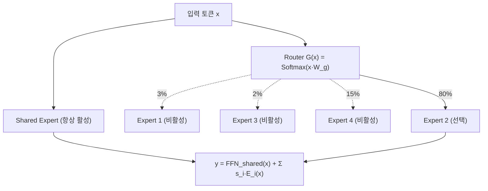
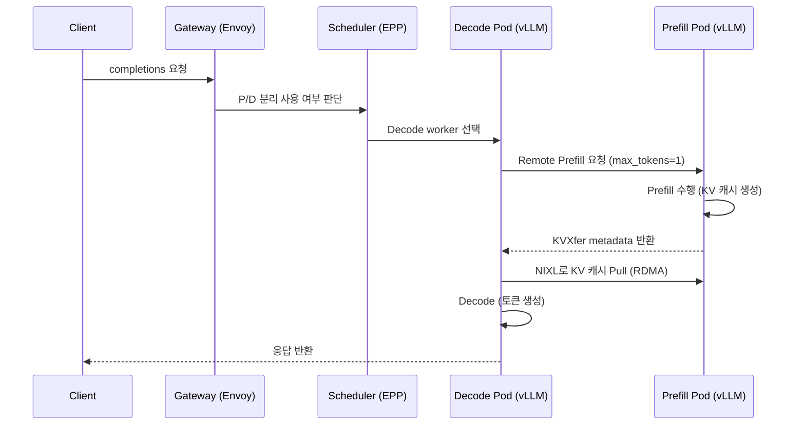

---
tags:
  - vLLM
  - LLM
  - Speculative Decoding
  - Tensor Parallelism
  - Pipeline Parallelism
  - Expert Parallelism
  - PD Disaggregation
  - KV Cache
  - SGLang
  - TensorRT-LLM
---

# 고급 LLM 최적화 기법 & 서빙 프레임워크

> GPU 한 대에 담기지 않는 초대형 모델을 위한 4대 고급 최적화 기법(Speculative Decoding, 멀티 GPU/노드 병렬화, Prefill-Decode Disaggregation, 고급 KV 캐싱)과, 이를 실제로 구현하는 LLM 서빙 프레임워크 4종(vLLM, TensorRT-LLM, SGLang, llama.cpp)을 정리한다.

## 개요

지난 주차까지 다룬 최적화 기법들은 GPU 한 대에 올라가는 모델을 서빙할 때 필요한 핵심 기법이었다. 하지만 1,000억(100B) 파라미터가 넘는 초대형 모델은 GPU 한 대의 메모리에 다 올릴 수 없거나, 올리더라도 만족스러운 지연시간을 내기 어렵다. 이번 주차는 이런 초대형 모델을 여러 GPU/노드에 걸쳐 효율적으로 서빙하는 고급 기법과, 이 모든 것을 구현하는 서빙 프레임워크 계층을 다룬다.

| 기술 | 해결하려는 문제 | 주로 개선하는 것 |
|------|----------------|------------------|
| Speculative Decoding | Decode가 토큰 하나씩 생성되어 느림 | ITL, Decode latency |
| DP / TP / PP / EP | 모델이 GPU 하나에 안 들어가거나 처리량 부족 | 메모리 용량, throughput, latency |
| PD Disaggregation | Prefill과 Decode가 서로 다른 GPU 특성을 요구 | TTFT + ITL 독립 최적화 |
| Advanced KV Cache | 긴 Context의 Prefill 반복 및 GPU 메모리 부족 | TTFT, cache hit, 비용 |

장 전체를 관통하는 축은 두 가지다.

- **compute-bound vs memory-bound**: 모든 기법의 효과 여부는 현재 병목이 연산인지 메모리 대역폭인지에 따라 갈린다.

- **핸드오프 비용**: 네 기법 모두 속도/처리량 이득의 대가로 "무언가를 옮기는 비용"(드래프트 검증 오버헤드, GPU 간 통신, KV 캐시 전송, 캐시 저장 비용)을 치른다. 이 비용을 이득이 능가할 때만 적용할 가치가 있다.

## Speculative Decoding

### 핵심 아이디어

Decode 단계는 토큰을 하나씩 자기회귀적으로 생성하기 때문에 memory-bound다. 추측적 디코딩(Speculative Decoding)은 작은 **드래프트(draft) 모델**이 여러 토큰을 미리 빠르게 생성하고, 크고 정확한 **타깃(target) 모델**은 이를 하나씩 순차 생성하는 대신 한 번의 forward pass로 병렬 검증만 하게 해서 속도를 높인다.

동작 순서는 다음과 같다.

1. Draft 모델이 K개 토큰을 빠르게 추측 생성한다.

2. Target 모델이 한 번의 forward pass로 K개 토큰을 동시에 검증한다.

3. 각 토큰마다 target의 확률이 draft의 확률 이상이면 그대로 수락하고, 낮으면 비율(target/draft)만큼 확률적으로 수락/거부한다.

4. 거부되는 순간 그 이후 토큰은 모두 폐기하고(자기회귀 특성상 앞 토큰이 바뀌면 뒤는 무의미), target이 수정된 분포에서 새 토큰을 직접 샘플링해 이어간다.


결국 토큰 출력 속도 향상의 핵심은 **스텝당 수락되는 토큰의 개수**다. 예를 들어 3개 토큰 디코딩 과정에서 메모리 이동량이 원 모델 단독 사용 시 420GB인 반면, 추측적 디코딩 사용 시 147GB까지 줄어든다.

### 정확도 보존

이 기법의 가장 큰 장점은 속도는 얻지만 품질 저하가 없다는 것이다. 거부 시 target 모델은 `원 모델 확률 - 초안 모델 확률`을 계산하고 음수를 0으로 클리핑한 뒤 재정규화한 분포에서 새 토큰을 샘플링한다(rejection sampling). 수용 단계와 대체 단계의 확률을 더하면 타깃 모델의 원래 분포가 완벽하게 복원되므로, 최종 출력은 추측적 기법을 쓰지 않은 일반 자기회귀 디코딩과 수학적으로 동일한 분포를 따른다.

### 드래프트 선택 방법

| 방법 | 방식 | 장점 | 단점 |
|------|------|------|------|
| 기존 소형 모델 | 같은 계열의 작은 모델을 그대로 사용(양자화 권장) | 구현 간단 | 정렬 안 맞으면 수락률 낮음 |
| 증류(Distillation) | 타깃 모델로부터 소형 모델을 직접 학습 | 수락률 높음, 타깃 스타일에 특화 | 별도 학습 필요 |
| 셀프 드래프팅 (Medusa, EAGLE) | 타깃 모델 자체에 예측 헤드/모듈 추가 | 별도 모델 불필요, GPU 메모리 절약, 정렬 우수 | 추가 학습/튜닝 필요 |
| N-gram | 프롬프트 내 반복 패턴을 테이블화해 매칭 | 오버헤드 거의 0, 구현 최간단 | 반복성 낮은 자유 생성에 약함 |

셀프 드래프팅 계열의 차이는 다음과 같다.

- **Medusa**: 타깃 모델에 여러 개의 경량 예측 헤드를 추가해, 한 번의 순전파 안에서 두 번째, 세 번째, 네 번째 이후 토큰 후보를 병렬로 생성한다. 후보 시퀀스 중 가장 길게 수락되는 것을 선택한다.


원본 모델의 LM head는 첫 토큰 후보(It, I, As)만 내놓지만, 같은 순전파 안에서 Medusa head 1~3이 두 번째·세 번째·네 번째 토큰 후보를 추가로 만든다. 이를 조합한 후보 시퀀스 중 "It is difficult"가 수락되어, 순전파 한 번에 토큰 3개가 확정된다. 추측적 디코딩이 없었다면 이 한 번의 순전파는 "It" 하나만 냈을 것이다.

- **EAGLE**: 토큰을 직접 드래프트하지 않고 타깃 모델의 미래 은닉 상태(hidden state)를 예측하는 작은 보조 모듈을 사용한다. EAGLE-2는 텍스트 예측 가능성에 따라 추측 길이를 조절하는 동적 드래프트 트리를 도입했고, EAGLE-3는 여러 레이어의 feature를 융합해 정확도를 높였다. 현재 가장 성능이 뛰어난 셀프 드래프팅 기법 중 하나다.


Medusa가 마지막 은닉 상태 하나만 쓰는 것과 달리, EAGLE-3는 initial/middle/higher 레이어 각각의 은닉 상태를 하나의 fused feature vector로 합쳐 Eagle head에 넣는다. 여기서 나온 드래프트 토큰이 rejection sampling과 SoftMax를 거쳐 수락 여부가 결정되는 흐름까지 한 그림에 담겨 있다.

- **N-gram**: 요청 앞부분에서 인접한 n개 토큰 시퀀스를 테이블에 저장한 뒤 매칭으로 다음 토큰을 제안한다. JSON/SQL 같은 구조화된 출력이나 템플릿 채우기처럼 프롬프트의 패턴이 재사용되는 상황에서 특히 강력하다. 오버헤드가 거의 없어 다른 방법보다 먼저 시도해볼 만하다.

### K 튜닝

K(드래프트 토큰 최대 개수)는 핵심 튜닝 파라미터다.

- K를 키우면 잠재적 속도 향상 상한이 높아지지만, 수락률이 낮으면 버려지는 연산도 늘어난다.

- K를 줄이면 예측 가능하고 안정적이지만 이득이 제한된다.

- 실무 권장은 보통 4~8이며, 구조화된 출력이나 함수 호출처럼 예측 가능성이 높으면 16~32까지도 가능하다.

- 위치별 수락률(예: K=6에서 `[0.8, 0.7, 0.6, 0.5, 0.10, 0.02]`)을 모니터링해, 이득이 없는 뒷부분은 K를 줄여 잘라내는 것이 실전 튜닝법이다.

### 한계

1. **decode 단계에만 유효**: 긴 입력 컨텍스트로 이미 compute-bound인 prefill 상황에서는 효과가 없다.

2. **큰 배치는 효과를 줄임**: 대규모 배칭은 병목을 memory-bound에서 compute-bound로 전환시키므로, 지연시간은 개선돼도 추가 연산이 전체 처리량을 해칠 수 있다.

3. **엔지니어링 난이도**: 두 모델을 한 GPU에서 효율적으로 운용하는 것 자체가 어렵다. 그래서 최근 트렌드는 별도 드래프트 모델보다 셀프 드래프팅 + n-gram으로 이동 중이다.

4. **정적 K의 한계**: 고정 K는 변화하는 수요를 반영하지 못해 적응형(adaptive) K 연구가 활발하다.

결론적으로 추측적 디코딩은 **처리량이나 TTFT를 다소 희생해도 ITL을 낮추고 싶은, memory-bound·저배치·저지연 시나리오**에서 가장 강력하다.

### Hands-on: Qwen3-32B 벤치마크

A100-SXM4-80GB에서 Qwen3-32B를 대상으로 바닐라 / n-gram / 개선된 n-gram / EAGLE-3 네 가지 설정을 동시성 1(저부하)과 16(고부하)에서 비교한 결과다.

```bash
# vanilla vLLM
vllm serve Qwen/Qwen3-32B --max-model-len 2048 --gpu-memory-utilization 0.95

# n-gram
vllm serve Qwen/Qwen3-32B \
  --speculative-config '{"method": "ngram", "num_speculative_tokens": 6,
    "prompt_lookup_min": 4, "prompt_lookup_max": 6}'

# improved n-gram (매칭 범위 확대로 수락률 상승, K는 낮춰 오버헤드 감소)
vllm serve Qwen/Qwen3-32B \
  --speculative-config '{"method": "ngram", "num_speculative_tokens": 4,
    "prompt_lookup_min": 2, "prompt_lookup_max": 128}'

# EAGLE-3
vllm serve Qwen/Qwen3-32B \
  --speculative-config '{"method": "eagle3",
    "model": "RedHatAI/Qwen3-32B-speculator.eagle3", "num_speculative_tokens": 3}'
```


| 조건 | 결과 |
|------|------|
| 동시성 1 (저부하) | 개선된 n-gram은 바닐라 대비 +16% throughput, EAGLE-3는 거의 2배(56.5 vs 28.9 tokens/s) |
| 동시성 16 (고부하) | n-gram 두 설정 모두 바닐라보다 오히려 느림(제안·검증 오버헤드), EAGLE-3는 여전히 우세하나 격차 축소 |
| TTFT vs ITL (동시성 16) | 모두 ITL은 개선하지만, EAGLE-3는 추가 헤드/모듈 오버헤드로 TTFT가 오히려 크게 증가 |

핵심 통찰은 앞의 이론과 정확히 일치한다.

- 저부하(memory-bound)일 때 효과가 최대다. GPU가 놀고 있으므로 드래프팅 연산이 거의 공짜다.

- 고부하(compute-bound)로 전환되면 오버헤드가 손해로 작용한다. 오버헤드가 상대적으로 큰 일반 n-gram이 가장 먼저 역효과를 낸다.

- EAGLE-3처럼 정교한 방법일수록 prefill 시점(TTFT)에 오버헤드를 지불하고 decode 구간(ITL)에서 이득을 얻는다. SLA가 TTFT에 민감한지 ITL에 민감한지에 따라 선택이 갈린다.

- 최적의 방법과 K값은 데이터셋·워크로드에 크게 의존하므로, 반드시 실제 트래픽 패턴으로 수락률을 측정하며 튜닝해야 한다.

VRAM이 작은 환경에서는 결과가 정반대로 나올 수 있다. RTX 16GB에 Qwen3-8B-FP8을 올려 동시성 1로 측정했을 때 바닐라 상태에서 이미 GPU 사용률이 98%에 달했고(Tensor Core utilization 또는 VRAM bandwidth utilization이 원인으로 추정), 이 상태에서 추측적 디코딩을 켜자 오히려 역효과가 났다. 동시성이 1이라도 GPU가 이미 포화 상태면 memory-bound가 아니므로 드래프팅 연산이 공짜가 아니게 된다.

### vLLM이 지원하는 방식

| 방식 | Low QPS (지연시간 중심) | High QPS (처리량 중심) | 비고 |
|------|------------------------|----------------------|------|
| EAGLE | High gain | Medium to high gain | 범용적으로 강력한 모델 기반 방식 |
| MTP (Multi-Token Prediction) | High gain | Medium to high gain | 타깃 모델이 MTP를 네이티브 지원할 때 최선 |
| Draft model | High gain | Medium gain | 별도 드래프트 모델 필요 |
| Parallel Draft Model (PARD) | High gain | Medium to high gain | 드래프트 모델 지연시간이 낮음 |
| MLP speculator | Medium to high gain | Medium gain | 호환되는 MLP speculator가 있을 때 유용 |
| N-gram | Low to medium gain | Medium gain | 가볍고 활성화가 쉬움 |
| Suffix decoding | Low to medium gain | Medium gain | — |
| Dynamic Speculative Decoding | High gain | 기본 SD보다 높음 | 추가 드래프트 모델 없이 추측 깊이를 동적 조절, QPS 변동이 큰 워크로드나 RL에 유용 |

기본 스키마는 다음과 같다.

```bash
vllm serve <target-model> \
  --speculative-config '{"method": "draft_model", "model": "<draft-model>",
    "num_speculative_tokens": 5}'
```

드래프트 모델을 직접 학습하려면 vLLM과 통합된 [speculators](https://github.com/vllm-project/speculators) 라이브러리를 쓸 수 있다. vLLM으로 은닉 상태 생성 데이터를 오프라인 생성하고, 단일/다중 레이어 드래프트 모델을 학습하며, Hugging Face 호환 표준 포맷으로 내보내 vLLM에 바로 배포하는 흐름을 지원한다.

여러 기법을 동일 환경에서 공정하게 비교하려면 [Spec-Bench](https://github.com/hemingkx/Spec-Bench)가 있다. EAGLE-1/2/3, Medusa, Hydra, SpS, Prompt Lookup Decoding, REST, Lookahead Decoding, TokenRecycling, SAM-Decoding 등을 실제 구현체로 포함하며, `evaluation/speed.py`로 speedup을, `evaluation/equal.py`로 추측적 디코딩 결과가 일반 자기회귀 디코딩과 동일한지를 검증한다. 앞서 설명한 "정확도를 훼손하지 않는다"는 이론적 보장을 실제로 확인하는 스크립트가 후자다.

## Multi-GPU and Multi-Node Inferencing

모델이 GPU 한 대에 안 들어가거나 한 대로는 SLA를 충족할 수 없을 때, 추론 시스템은 네 가지 병렬화 전략을 사용한다.

- **Data Parallelism(DP)**: 모델 인스턴스를 복제해 처리량을 확장한다.

- **Tensor Parallelism(TP)**: 레이어를 너비 방향으로 분할해 지연시간을 줄인다.

- **Pipeline Parallelism(PP)**: 레이어들을 깊이 방향으로 단계별 분할한다.

- **Expert Parallelism(EP)**: MoE(Mixture-of-Experts) 모델의 전문가들을 GPU에 분산한다.

### Data Parallelism

DP는 소프트웨어의 수평 확장과 동일한 개념이다. 모델을 여러 벌 복제해 각 복제본이 트래픽의 일부만 처리하게 함으로써 처리량과 고가용성을 확보한다.


로드밸런서가 요청 9개를 3개 인스턴스에 3개씩 균등 분배해 어느 쪽도 과부하되지 않는다. 한 인스턴스가 다운되면 라우터가 그쪽으로 보내는 것을 멈추고 나머지 두 인스턴스로 요청을 재분배한다.


라우팅 전략은 단순한 것부터 정교한 것까지 4단계로 발전했다.

- **Round robin**: 순서대로 순환 배분한다. 단순하지만 요청 길이 편차를 무시한다.

- **Least connections**: 활성 연결 수가 가장 적은 인스턴스로 보낸다. 부하는 보지만 요청의 난이도/길이는 무시한다.

- **Latency 기반**: 실시간 응답 속도를 모니터링해 가장 빠른 인스턴스로 보낸다. tail latency 개선에 도움이 된다.

- **Cache-aware routing**: LLM 특화 전략이다. 동일한 프리픽스를 가진 요청을 이미 그 KV 캐시를 보유한 인스턴스로 보내 prefix caching 적중률을 높인다.

LLM 라우팅이 일반 웹서비스 라우팅보다 훨씬 정교해야 하는 이유는 (a) 요청마다 처리 비용 편차가 크고(짧은 프롬프트 vs 긴 프롬프트), (b) GPU가 매우 비싸 비효율적 라우팅의 기회비용이 크기 때문이다. 실제로는 KV 캐시 지역성/적중률, KV 캐시 공간 사용률, 큐 대기열 길이, SLA 지연시간 예산 등 실시간 신호를 종합해 라우팅하는 시스템(NVIDIA Dynamo의 KV Router, llm-d 등)으로 발전했다.

### Tensor Parallelism vs Pipeline Parallelism

| 구분 | TP | PP |
|------|----|----|
| 분할 방향 | 너비(width) — 레이어 하나를 여러 GPU에 분할 | 깊이(depth) — 레이어 블록을 GPU별로 분할 |
| 통신 발생 | 매 레이어마다 GPU 간 통신 필요 | 스테이지 경계에서만 통신 |
| 약점 | 통신량이 많아 고속 인터커넥트(NVLink) 필수 | 느린 스테이지가 있으면 파이프라인 버블(유휴 시간) 발생 |
| 적합 환경 | NVLink로 연결된 노드 내부 | 상대적으로 느린 노드 간 연결 |


4개 레이어를 두 GPU에 나누는 두 방식이 나란히 보인다. TP=2는 각 레이어를 세로로 갈라 절반씩 두 GPU가 나눠 갖고, PP=2는 레이어 1·2를 GPU 1에, 3·4를 GPU 2에 배정한다.


이 차이가 통신량으로 직결된다. TP는 레이어마다 GPU 1↔2 통신이 발생해 화살표가 4개인 반면, PP는 레이어 2에서 3으로 넘어가는 경계에서 단 한 번만 통신한다. 대신 PP는 앞 스테이지가 느리면 뒤 GPU가 노는 파이프라인 버블을 떠안는다.

### 병렬화 선택 기준


1. **가능하면 GPU 1개로 해결한다.** GPU 메모리 대역폭(H100 기준 ~3TB/s)이 GPU 간 인터커넥트(NVLink ~900GB/s)보다 약 3배 빠르기 때문에, GPU를 늘려도 성능이 선형적으로 증가하지 않는다. 여러 개의 하위 사양 GPU보다 메모리가 큰 상위 사양 GPU 하나가 낫다.

2. **메모리가 부족하면 먼저 양자화를 시도한다.** FP8은 모델 크기를 절반으로, W4A16은 1/4까지 줄일 수 있다.

3. **그래도 안 되면 멀티 GPU 노드로 간다.** 노드 내부가 NVLink로 연결되어 있으면 TP가 최선이다. NVLink 없이 PCIe만 있다면 TP는 너무 느리므로 PP를 쓰거나 TP를 최소화한다.

4. **노드 하나(8-GPU)에도 안 들어가면 멀티 노드로 간다.** TP는 노드 내부(NVLink)에서만, PP는 노드 간(InfiniBand/RoCEv2)에 적용하는 하이브리드가 표준이다(Megatron Rule).


| 상황 | 권장 설정 |
|------|-----------|
| 단일 GPU에 모델이 들어감 | TP=1, PP=1 (병렬화 자체를 피함) |
| 8-GPU NVLink 노드 하나에 들어감 | TP=8, PP=1 |
| 노드 하나에도 안 들어감 (멀티 노드) | 노드 내부 TP, 노드 간 PP (예: 2노드×8GPU → TP=8, PP=2) |
| NVLink 없는 GPU (PCIe만) | TP 최소화(1~2), PP 위주 구성 |

### vLLM 설정 치트시트

```bash
# 단일 GPU
vllm serve <model>

# 단일 노드, 8-GPU NVLink (TP만)
vllm serve <model> --tensor-parallel-size 8

# 단일 노드, TP+PP 혼합 (총 GPU 수 = TP × PP)
vllm serve <model> --tensor-parallel-size 4 --pipeline-parallel-size 2

# 멀티 노드 (Ray 필요), 2노드×8GPU
ray start --head --port=6379            # 헤드 노드
ray start --address='<head-ip>:6379'    # 워커 노드
vllm serve <model> --tensor-parallel-size 8 --pipeline-parallel-size 2 \
  --distributed-executor-backend ray
```

설정 시 주의할 제약은 다음과 같다.

- `tensor_parallel_size`는 모델의 attention head 수를 나눠떨어지게 해야 한다(예: head 32개면 TP는 1/2/4/8/16/32만 가능). GQA/MQA 모델은 KV head 수 제약도 있다.

- TP를 노드 경계 너머로 설정하면 매 레이어 all-reduce가 InfiniBand를 거쳐 극심한 성능 저하가 발생한다. 반드시 TP ≤ 노드 내 NVLink GPU 수로 제한한다.

- PP만으로 멀티 노드를 구성했는데 느리다면 `--max-num-seqs` 등을 늘려 파이프라인을 계속 채워야 버블이 줄어든다. vLLM의 continuous batching이 여러 요청으로 파이프라인을 채워 버블을 완화해준다.

- NVLink 유무는 `nvidia-smi topo -m`으로 확인한다(NVLink면 `NV#`, PCIe만이면 `PHB/PXB`).

vLLM의 DP 배포는 세 가지 로드밸런싱 아키텍처를 지원한다.

- **Internal LB**: 단일 API 엔드포인트가 큐 상태를 보고 DP rank들에게 내부적으로 요청을 분배한다.

- **Hybrid LB**: 각 노드가 자체 API 서버를 두고 자기 노드의 엔진에만 스케줄링하며, 노드 간은 외부 로드밸런서가 처리한다.

- **External LB**: 각 DP rank가 완전히 독립된 엔드포인트로 동작하고, 외부 라우터가 실시간 텔레메트리로 분산한다. 대규모 배포에 유리하다.

각 DP rank는 독립적인 KV 캐시를 유지하므로 prefix caching 효율을 높이려면 cache-aware routing이 필요하고, `--max-num-seqs`는 전역이 아니라 DP rank마다 개별 적용된다는 점에 주의한다.

### Expert Parallelism

Mixtral, DeepSeek-V3, GPT-OSS 같은 최신 LLM은 MoE 레이어를 사용한다. 라우터가 토큰마다 소수의 전문가만 선택적으로 활성화해, 큰 모델의 성능을 유지하면서 토큰당 연산량을 줄인다. 예를 들어 총 파라미터 2.8T급 모델도 토큰당 실제 활성화되는 파라미터는 약 104B에 불과하다.


Router가 각 전문가에 점수를 매기고(막대그래프) 그중 Expert 1만 선택해 활성화한다. 나머지 셋은 회색으로 비활성 상태다.



MoE 관련 핵심 개념은 다음과 같다.

- **Sparse Top-K 라우팅**: 라우터가 상위 K개 전문가만 활성화해 연산량을 줄인다(예: 4개 중 1개 선택 시 Active Compute 25%).

- **Shared Expert**: 문법/구두점처럼 모든 토큰에 공통되는 패턴을 담당하는, 라우터를 거치지 않고 항상 활성화되는 전문가다. DeepSeek-V3(1 shared + 256 routed), Llama 4 Maverick, Kimi K2는 사용하고, Qwen3-235B는 의도적으로 생략했다.

- **Fine-Grained MoE**: 전문가를 잘게 쪼갤수록 조합의 다양성이 기하급수적으로 늘어 표현력이 좋아진다(16개 중 2개 = 120가지 vs 64개 중 8개 = 44억 가지 이상).

문제는 토큰당 연산량은 줄어도 전체 전문가 파라미터 총합이 너무 커서 단일 GPU에 담기지 않는다는 것이다. EP는 전문가들을 여러 GPU에 나눠 배치하고, 각 토큰을 선택된 전문가가 위치한 GPU로만 전달해 이를 해결한다. EP는 단독이 아니라 TP·PP·DP와 상호보완적으로 결합된다.


전문가 4개를 두 GPU에 2개씩 나눠 배치한 형태다. 라우터가 Expert 3을 골랐다면 GPU 2에만 연산이 요청되고, GPU 1은 그 토큰에 대해 아무 일도 하지 않는다.

vLLM에서의 EP 핵심 사항은 다음과 같다.

- 병렬화 크기 관계식: `EP_SIZE = TP_SIZE × DP_SIZE`

- `--enable-expert-parallel`을 켜지 않으면 MoE 레이어는 EP(all-to-all) 대신 TP(all-reduce)로 처리된다.

- all-to-all 통신 백엔드는 워크로드에 따라 선택한다: `deepep_high_throughput`(멀티노드, prefill 위주), `deepep_low_latency`(멀티노드, decode 위주) 등.

- **EPLB(Expert Parallel Load Balancer)**: 전문가마다 라우팅되는 토큰 수가 불균등한 hot expert 문제를 동적으로 재조정한다. `--enable-eplb`로 활성화하며, 인기 전문가를 복제(redundant expert)해 부하를 분산한다(DeepSeek-V3 기준 중복 전문가 1개당 약 2.4GB 추가 메모리).

- DeepSeek처럼 MLA를 사용하는 MoE 모델은 attention 레이어에는 DP를, expert 레이어에는 EP나 TP를 쓰는 것이 유리하다. attention은 all-reduce, MoE는 all-to-all이라는 통신 특성 차이 때문이다.

```bash
# 단일 노드 (H200 x8, DeepSeek-V3): TP=1 × DP=8 → EP=8
vllm serve deepseek-ai/DeepSeek-V3-0324 \
  --tensor-parallel-size 1 --data-parallel-size 8 --enable-expert-parallel
```

EP를 쓰려면 사전 준비가 필요하다. DeepEP(EP 커널, `tools/ep_kernels`), DeepGEMM(최적화된 연산 라이브러리), gdrcopy(분리 서빙용, 선택이지만 권장), 그리고 `deepep_v2` 백엔드를 쓸 경우 NCCL 2.30.4 이상(PyTorch 기본 NCCL은 더 낮은 버전이라 업그레이드 필요)이 요구된다.

자주 마주치는 문제와 해결책은 다음과 같다.

| 증상 | 해결 |
|------|------|
| InfiniBand 클러스터에서 동작 안 함 | `export GLOO_SOCKET_IFNAME=eth0` 설정 |
| "Register CQ buffer" 에러 | `ulimit -l`을 `unlimited`로 설정 |
| IBGDA 커널 문제 | `tools/ep_kernels/configure_system_drivers.sh` 실행 |
| Kubernetes 파드에서 실패 | `hostNetwork: true`, `securityContext.privileged: true` 필요 |

## Prefill-Decode Disaggregation

### 왜 분리하는가

TP·PP는 "모델을 어떻게 GPU에 나눠 담을까"만 해결할 뿐, 추론의 2단계 특성에서 비롯되는 비효율은 해결하지 못한다.

- **Prefill**: 전체 입력 시퀀스를 병렬 처리 — compute-bound (예: 2,048토큰 일괄 처리 시 Compute 96%, Bandwidth 18%)

- **Decode**: 토큰을 순차 생성 — memory bandwidth-bound (예: Compute 5%, Bandwidth 87%)

두 국면이 정반대의 하드웨어 자원을 요구하는데, 같은 GPU에 배치(colocation)하면 서로 간섭(interference)이 발생하고 어느 쪽도 100% 만족시키지 못하는 타협이 생긴다. Chunked prefill로 일부 완화는 가능하지만 근본적 해결책은 아니다. PD(Prefill-Decode) 분리는 두 단계를 물리적으로 서로 다른 GPU 풀로 분리한다.

### 4가지 이점

1. **TTFT/ITL 독립 최적화**: 입력이 긴 워크로드는 prefill에 자원을 몰아 TTFT를 줄이고, 출력이 긴 워크로드는 decode에 자원을 몰아 ITL을 줄인다. 간섭이 없어 ITL도 더 안정적이고 예측 가능해진다.


세 가지 전형적인 패턴이 보인다. 긴 컨텍스트에 짧은 답변(문서 요약·검색), 짧은 컨텍스트에 긴 추론 출력(reasoning), 둘 다 긴 경우다. 첫 번째는 TTFT가, 두 번째는 ITL이 지배적이므로 자원을 어느 쪽에 몰아야 하는지가 갈린다.

2. **워크로드별 독립 최적화**: prefill은 배치를 키워 텐서 코어를 포화시키고, decode는 메모리 대역폭 병목이 풀릴 만큼 배치를 키운다. TP/PP도 단계별로 다르게 적용할 수 있다(이종 병렬화).

3. **하드웨어 선택 다양화**: H100과 H200은 FLOPS는 같지만 메모리 대역폭이 다르다(3.35TB/s vs 4.8TB/s). prefill에는 연산 최적화 GPU(H100), decode에는 메모리 최적화 GPU(H200) 또는 저비용 L40S를 매칭해 비용을 최적화할 수 있다.

4. **독립적·비대칭적 스케일링**: 버스트성이 강한 prefill은 공격적 오토스케일링, 예측 가능한 decode는 안정적 스케일링 전략과 짝짓는다.

실증 수치로는 DistServe 논문이 동일 SLA 충족에 필요한 자원이 12.6배 효율적임을, Splitwise 논문이 80% 비용으로 1.4배 처리량 달성을 보고했다.

### 아키텍처


핵심 흐름은 "컨트롤러 → prefill → KV 캐시 전송 → decode" 3단계다.

1. Controller가 모든 요청의 진입점 역할을 하며 라우팅을 담당한다.

2. 요청이 먼저 Prefill 인스턴스로 전송되어 처리되고, 이 과정에서 KV 캐시가 생성된다.

3. 생성된 KV 캐시가 Decode 인스턴스로 전달되고, decode 인스턴스가 이어받아 토큰을 순차 생성한다.

Kubernetes 환경의 실제 구현체인 llm-d는 vLLM과 Gateway(Envoy)를 조합해 이 흐름을 구현한다.



Prefill 요청의 `max_tokens=1`은 prefill 단계에서 토큰을 1개만 생성하고 끝내는(= KV 캐시만 계산하는) 용도다.

MoE 모델에서는 EP 크기도 단계별로 다르게 가져간다. 예를 들어 프로덕션에서 Prefill Pool은 EP 32(GPU당 전문가 9개씩 조밀하게), Decode Pool은 EP 144(GPU당 2개씩 성기게)로 구성한다. MoE의 스파스성은 decode 단계에서 continuous batching으로 큰 배치를 모아야 의미를 가지기 때문이다(배치 64면 전문가당 겨우 2개 토큰, 배치 4,096이면 전문가당 128개 토큰).

### KV Cache Transfer

PD 분리의 성능 이득은 반드시 KV 캐시 전송 오버헤드를 능가해야 한다. KV 캐시 크기는 입력 길이에 거의 선형 비례한다. 8B 모델·1,024토큰 기준 약 0.1~0.15GB이고, 10배 긴 입력이면 1~1.5GB다. 여기에 처리량(초당 16개 요청)을 곱하면 초당 약 25GB의 KV 캐시를 전송해야 한다.

| 인터커넥트 | 대역폭 | 25GB/s 감당 여부 |
|-----------|--------|------------------|
| NVLink (노드 내) | ~900GB/s+ | 여유 있게 감당 |
| InfiniBand (노드 간, RDMA) | ~50~100GB/s | 그럭저럭 감당 |
| PCIe (노드 간, RDMA 없음) | ~10GB/s | 감당 불가 → 병목 |


prefill/decode를 같은 노드 안에만 배치하면 NVLink로 안전하지만, 동일 하드웨어를 강제하고 병렬화 확장성을 제한한다. 결국 노드 간 배치 + RDMA(InfiniBand)는 필수가 되며, 그 위에 4가지 최적화를 얹는다.

1. **청크 전송**: 전체를 한 번에 보내지 않고 스트리밍처럼 작은 블록 단위로 전송한다.

2. **비동기·논블로킹 전송**: prefill 연산과 전송을 오버랩시켜 전송 시간을 연산 뒤에 숨긴다.

3. **레이어 단위 전송**: KV 캐시는 레이어별로 독립적이므로, prefill이 다음 레이어를 계산하는 동안 완료된 레이어의 캐시를 먼저 보내 decode가 더 일찍 시작하게 한다.

4. **KV 캐시 압축/양자화**: 전송할 데이터 자체의 크기를 줄인다.


세 막대가 계단처럼 겹쳐 있는 것이 요점이다. GPU prefill이 아직 끝나지 않은 시점에 background KV transfer가 시작되고, 그 전송이 끝나기 전에 GPU decode가 시작된다. 전송 시간이 연산 뒤로 숨어 사실상 사라진다.

이 최적화들과 스케줄링 개선을 모두 적용하면 PD 분리 오버헤드를 요청당 전체 지연시간의 1% 미만까지 줄일 수 있다(Wang et al., 2025).

실제 전송 계층은 NIXL(NVIDIA Inference Xfer Library)이 표준으로 쓰인다.

- GPU 메모리, CPU 메모리, 파일/블록/오브젝트 스토리지까지 하나의 API로 추상화한다.

- 전송 스택은 NIXL → UCX → IB/RoCE/TCP 계층 구조로, CPU를 거치지 않는 GPU Direct RDMA로 Zero Copy 전송을 구현한다.

- 필요한 KV 블록 인덱스만 선택적으로 pull할 수 있어 Zero Memory Overhead로 wire speed에 가까운 전송이 가능하다.

- vLLM에서는 `--kv-transfer-config '{"kv_connector":"NixlConnector","kv_role":"kv_both"}'`로 설정한다.

캐싱은 LMCache가, 실제 전송은 NIXL이 담당하는 계층 구조이며, Moonshot AI(Kimi)의 Mooncake처럼 Prefill/Decode 풀 사이에 전용 KV 캐시 풀을 두는 사례도 있다.

Kubernetes에서 PD 분리를 배포하는 경로는 세 가지다.

| 방식 | 배포 형태 |
|------|-----------|
| llm-d (Well-Lit-Path) | Kustomize 기반 매니페스트로 직접 배포 |
| KServe (내부적으로 llm-d 활용) | CRD 기반 (InferenceService / LLMInferenceService) |
| NVIDIA Dynamo | CRD 기반 (DynamoGraphDeployment / DynamoGraphDeploymentRequest) |

### 언제 사용하나

llm-d 벤치마크에서 P/D 노드 비율(1p/3d, 2p/2d, 3p/1d)을 바꿔 비교한 결과, prefill-heavy 워크로드에서 decode 비중이 지나치게 높으면(1p/3d) prefill이 병목이 되어 타임아웃으로 완전히 실패했고, decode-heavy 워크로드에서는 분리 이득이 거의 없고 오히려 latency가 악화됐다. 즉 PD 분리는 **워크로드 특성과 P/D 노드 비율을 맞게 튜닝해야만 효과**를 보는 기법이며, 무조건 적용한다고 좋아지지 않는다.


고급 TTFT/ITL 튜닝이 필요한 대형 모델에만 PD 분리를 사용하고, 소형 모델에는 더 단순한 설정을 유지한다. 대략적 기준은 대형 모델(>20GB) + 엄격한 TTFT/ITL SLA + 긴 컨텍스트 + 고대역폭 인터커넥트 + 오케스트레이션 복잡도를 감당할 엔지니어링 여력이 모두 갖춰졌을 때다.

## Advanced KV Caching

### 왜 필요한가

코딩 코파일럿(수천 줄의 소스 코드), 대화형 에이전트(긴 대화 이력 + 테넌트별 지식 베이스), 엔터프라이즈 플랫폼(대규모 문서/거래 이력) 등 긴 컨텍스트 처리 수요가 계속 커지고 있다. 이는 결국 KV 캐시의 크기와 재사용 문제로 귀결되며, 캐시 오프로딩·계층적 캐싱·테넌트별 캐시 격리 같은 더 정교한 KV 캐시 관리가 필요해진다.

### RAG vs CAG

| 항목 | RAG | CAG |
|------|-----|-----|
| 방식 | 쿼리 시점마다 관련 문서를 검색해 프롬프트에 주입 | 관련 컨텍스트 대부분/전체를 KV 캐시로 미리 캐싱해 재사용 |
| 장점 | 컨텍스트 길이와 TTFT를 관리 가능한 수준으로 유지, 최신 정보 반영 용이 | 실시간 검색 불필요, 중복 연산 감소 → RAG보다 빠른 TTFT |
| 구현 | 임베딩 + 벡터 검색 파이프라인 | 프리픽스 캐싱(정적 지식=프리픽스, 동적 프롬프트=접미사)이 기초적 형태 |

CAG(Cache-Augmented Generation)가 최근 힘을 받는 이유는 두 가지다.

1. **긴 컨텍스트 모델의 발전**: 컨텍스트 윈도우가 100k~1M 토큰까지 확장되면서 테넌트의 전체 지식을 한 번에 로드하는 것이 가능해졌고, "lost in the middle"(컨텍스트 중간 정보를 놓치는) 문제도 완화되는 중이다.

2. **KV 캐시 관리 엔지니어링의 발전**: CPU 메모리/SSD/원격 스토리지로의 오프로딩과 복제본 간(cross-replica) 라우팅 덕분에, 대량의 지식을 KV 캐시로 캐싱해두고 꺼내 쓰는 것이 실용적으로 가능해졌다.

### 비용 및 지연시간 계산


| 항목 | RAG | Long-context CAG |
|------|-----|------------------|
| 캐싱된 토큰 | 500 (시스템 프롬프트) | 100,500 (시스템 프롬프트 + 전체 컨텍스트) |
| 캐싱 안 된(일반 prefill) 토큰 | 5,500 (청크 10개×500 + 사용자 프롬프트) | 500 (사용자 프롬프트만) |
| TTFT | 5초 (기준) | ~0.5초 (10배 개선) |
| 요청당 비용 | $0.007 | $0.013 (약 2배) |

반전이 생기는 이유는 다음과 같다.

- **TTFT 관점**: CAG는 캐싱 안 된 prefill 토큰이 RAG의 1/10이므로 압도적으로 빠르다. RAG의 임베딩/벡터 검색 시간까지 고려하면 격차는 더 커진다.

- **비용 관점**: 캐싱된 토큰도 공짜가 아니라 일반 입력의 10~25% 가격이 매겨진다. CAG는 캐싱된 토큰량 자체가 압도적으로 많아(100,500 vs 500), 할인 단가에도 불구하고 총액이 RAG보다 비싸진다. RAG의 숨겨진 비용(인덱싱, 벡터 스토리지, 검색)을 더해도 보통 LLM 호출 비용보다 훨씬 저렴하다.

실무적 시사점은 "긴 컨텍스트 CAG가 항상 정답은 아니다"라는 것이다.

- TTFT/응답속도가 최우선이고 비용 여유가 있다면 long-context CAG를 선택한다.

- 비용 효율이 중요하고 약간의 지연시간을 감수할 수 있다면 RAG가 여전히 유리할 수 있다.

- 실제 선택은 컨텍스트 크기, 캐시 재사용 빈도, 벤더별 캐싱 요금제를 모두 고려해 케이스별로 계산해야 한다.

## LLM Serving Frameworks

### 왜 전용 프레임워크가 필요한가

LLM 시대 이전의 범용 서빙 프레임워크(TensorFlow Serving, TorchServe, Triton)는 입력 크기가 짧고 텐서 형태가 고정된 이미지/정형 데이터 추론용으로 설계됐다. LLM 서빙은 근본적으로 다른 5가지 과제를 제기한다.

1. **자기회귀적 생성**: 토큰 단위 순차 생성으로 추론 세션이 수 초~수 분간 유지된다.

2. **컨텍스트 길이 폭증**: 입력이 수 토큰에서 백만 토큰까지 극단적으로 다양하고, KV 캐시 메모리 관리가 병목이 된다.

3. **연속 배칭 필요성**: 요청마다 입출력 길이가 크게 달라 정적 배칭은 GPU를 제대로 활용하지 못한다.

4. **스트리밍 요구**: TTFT 수백 ms 이내와 토큰 단위 실시간 스트리밍이 요구된다.

5. **자원 활용 압박**: 고가의 GPU에서 파편화나 유휴로 인한 FLOPS 낭비는 용납되지 않는다.

vLLM, TensorRT-LLM, SGLang 등은 페이지 단위 KV 캐싱, 연속 배칭, LLM 전용 양자화, 추측 디코딩 같은 혁신으로 이 문제들을 해결하며 LLM 서빙의 표준이 됐다. 이들은 단순한 inference wrapper가 아니라 scheduler, KV cache manager, model executor, worker, 분산 실행, 최적화 계층을 포함하는 **런타임**이다.

전체 스택은 두 티어로 나뉜다.

- **엔진 티어**: vLLM, SGLang, TensorRT-LLM, TGI — 스케줄러/KV 캐시/커널을 갖추고 실제 토큰을 생성한다.

- **오케스트레이션 티어**: NVIDIA Dynamo, llm-d(Kubernetes 네이티브) — 여러 노드에 걸친 분산 서빙을 조율하는 스케줄러/라우터일 뿐, 추론 엔진을 실행하지도 토큰을 직접 생성하지도 않는다("No Engine, No Token"). 실제 토큰 생성은 각 노드의 엔진 티어가 담당한다.

### vLLM Architecture

vLLM은 단일 모델 서비스 구성에 최적화되어 있으며, 두 가지 사용 방식을 제공한다.

- **LLM 클래스**: 인프로세스 파이썬 라이브러리. 서버 없이 오프라인/배치 워크플로우에 적합하다.

- **API 서버**: `vllm serve` 명령으로 실행하는 OpenAI 호환 HTTP 엔드포인트. 프로덕션/멀티클라이언트/스트리밍용이다.


내부 컴포넌트는 다음과 같은 계층 구조를 이룬다.

| 컴포넌트 | 역할 |
|----------|------|
| LLMEngine | 공개 API이자 주 진입점, 요청 생명주기 관리 |
| EngineCore | 중앙 오케스트레이터, 전체 파이프라인을 관리하는 내부 루프 |
| Scheduler | 자원 배분 "교통 관제사" — 토큰 스케줄링, 동적 배칭, 프리픽스 캐싱, 청크드 프리필 (모델 무관 최적화) |
| ModelExecutor | 다중 워커 프로세스 조율 |
| GPUWorker | 프로세스별 디바이스/모델 생명주기 관리 |
| GPUModelRunner | 실제 신경망 순전파 실행 |

핵심 설계 원칙은 **관심사 분리(separation of concerns)**다. Scheduler는 "언제, 무엇을, 어떻게 배치할지"를 결정하는 시스템 레벨(모델 무관) 최적화를 담당하고, GPUWorker는 실제 연산만 담당한다. 둘 사이의 계약은 `SchedulerOutput`이라는 "작업 지시서"(작업 배치, 요청별 토큰 수, 입력 데이터, 할당된 메모리 블록 포함)이며, 실행 결과는 다음 반복을 위해 스케줄러로 피드백된다. 이 분리 덕분에 배칭·스케줄링 최적화를 GPU 실행 로직과 독립적으로 개선할 수 있다.

### 모델 초기화 워크플로우


```python
llm = LLM(
    model="Qwen/Qwen2.5-7B-Instruct",
    tensor_parallel_size=4,               # 워커(GPU) 4개
    distributed_executor_backend="mp",    # 단일 노드 멀티 GPU는 mp, 멀티 노드는 ray
)
```

1. **메인 프로세스 초기화**: `LLM()` 생성 시 LLMEngine, Scheduler, KVCacheManager, MultiProcessExecutor 등 주요 컴포넌트를 메인 프로세스에서 기동한다.

2. **워커 프로세스 그룹 생성**: MultiProcessExecutor가 N개 워커 프로세스를 spawn하고, 메인 → 워커 명령 전달용 `rpc_broadcast_mq` 큐를 설정한다.

3. **워커 프로세스 초기화**: 각 워커가 GPUWorker를 실행해 CUDA 디바이스 설정, 프로세스 간 통신 수립, 모델 로드를 수행하고, 결과 회신용 `worker_response_mq` 큐를 유지한다.

4. **모델 준비 및 로드**: GPUModelRunner가 내부 모델 레지스트리에서 구현체를 조회하고(예: Qwen → `Qwen3NextForCausalLM`) 가중치를 GPU에 로드한다.

### 생성 요청 실행 워크플로우


`llm.generate(prompts, sampling_params)`를 실행하면 내부에서 다음이 일어난다.

| 단계 | 담당 컴포넌트 | 역할 |
|------|--------------|------|
| 1 | Processor | 입력 검증·토큰화 → Request 객체 생성 |
| 2 | LLMEngine → EngineCore → Scheduler | 다음 배치 결정, PagedAttention·Continuous Batching 등 최적화 적용 |
| 3 | MultiProcessExecutor → GPU Worker | 실제 모델 forward pass 실행 |
| 4 | Output Processor | 모델 출력 → 최종 응답 변환 |

### 계층적 최적화 전략

vLLM의 핵심 설계 철학은 "최적화는 그것이 속한 올바른 계층에서 이루어져야 한다"는 것이다. LLM 아키텍처와 하드웨어가 매우 빠르게 변하므로, 특정 모델·하드웨어에 최적화를 하드코딩하면 시스템이 금방 낡는다. vLLM은 최적화 책임을 4개 계층으로 분리한다.

| 계층 | 범위 | 예시 |
|------|------|------|
| Scheduler | 시스템 전반, 모델 무관 | 배칭, 캐싱, 공정성·처리량 관리 |
| ModelExecutor | 모델 아키텍처별 | Transformer용 융합 어텐션 커널, 멀티모달 인코더 특수 연산자 |
| 모델 레이어 | 컴포넌트별 | KV 캐시 재사용, FlashAttention, 레이어 단위 연산자 융합 |
| CustomOp | 하드웨어별 | CUDA 커널, 텐서 코어 가속, 양자화 연산자 |

위로 갈수록 범용적이고 아래로 갈수록 하드웨어에 특화된다. 각 계층이 자신의 관심사만 처리하므로 새 GPU가 나와도 Scheduler·모델 로직은 그대로 두고 CustomOp만 확장하면 되는, 미래 대비적(futureproof) 구조다.

### TensorRT-LLM

NVIDIA가 만든 자사 GPU 전용 고성능 LLM 추론 라이브러리다.

- **핵심 방식**: 모델 체크포인트를 고도로 튜닝된 TensorRT 엔진으로 컴파일한다.

- **주요 기능**: in-flight batching(연속 배칭), 페이지드 KV 캐시, 추측 디코딩, 다중 정밀도 양자화(FP8/FP4/INT4/INT8), TP/PP 병렬화

- **생태계**: NVIDIA Dynamo, Triton과 긴밀히 연동되며, vLLM과 거의 동일한 고수준 `LLM`/`generate()` 인터페이스를 제공한다.

- **포지셔닝**: 범용성이 아니라 NVIDIA 하드웨어에서 낼 수 있는 최대 실전 성능이 목표다. 이미 NVIDIA 하드웨어와 서빙 스택(Triton, Dynamo)으로 표준화된 조직에 가장 적합하다.

### SGLang

구조화된 생성(structured generation)과 에이전트 애플리케이션을 타깃으로 하는 vLLM의 직접적인 경쟁 프레임워크다.

- **설계 철학**: 빠른 백엔드 런타임(커널, 캐싱, 스케줄링)과 유연한 프론트엔드 언어/API를 공동 설계한다.

- **핵심 차별점 — RadixAttention**: 여러 호출에 걸친 KV 캐시 재사용을 radix tree 구조로 관리해, 반복적인 프리픽스가 많은 에이전트/멀티턴 시나리오에서 강점을 보인다.

- **핵심 기능**: 연속 배칭, 페이지드 KV, 추측 디코딩(EAGLE-2/3), 청크드 프리필, 구조화된 출력(JSON/정규식/EBNF), 멀티-LoRA, TP/PP/EP/DP 병렬화

- **하드웨어 지원**: NVIDIA뿐 아니라 AMD Instinct, CPU, TPU, Jetson Orin, Ascend까지 폭넓다. DeepSeek 재현/96 GPU 대규모 클러스터 서빙 사례가 있다.

### 프레임워크 선택 기준

| 프레임워크 | 강점 | 적합한 상황 |
|-----------|------|-------------|
| vLLM | 모델·하드웨어 무관, 가장 큰 오픈소스 생태계·커뮤니티(PyTorch 재단), 기본 설정만으로 예측 가능한 성능 | 범용 온라인 서빙, 멀티 테넌트, 다양한 하드웨어 |
| TensorRT-LLM | NVIDIA GPU 극한 성능(Tensor Core·CUDA 커널) | NVIDIA 생태계로 표준화된 프로덕션 |
| SGLang | RadixAttention 프리픽스 재사용, 구조화된 출력 | 에이전트/멀티턴 워크플로우, 구조화 생성 |
| llama.cpp | 경량, CPU/로컬 실행 | edge/local inference |

"어떤 프레임워크가 절대적으로 최고인가"가 아니라 "내 SLO·워크로드·운영 현실에 어떤 프레임워크가 맞는가"를 물어야 한다.

## GPU 실습 환경 구성

이번 주차의 기법 대부분은 멀티 GPU가 있어야 실측이 가능하다. 로컬에 GPU가 없을 때 쓸 수 있는 두 가지 경로를 정리한다.

### Runpod

컨테이너(Pod) 단위로 GPU를 빌려 vLLM을 바로 띄울 수 있다.

- **템플릿 선택**: vLLM Verified(Runpod 팀/파트너가 검증·유지보수, 이미지 빌드·호환성·보안 점검이 정기적으로 이뤄짐)를 쓴다. Community 템플릿은 검증되지 않아 오래된 vLLM 버전이나 깨진 의존성이 있을 수 있고, 특히 `cmd`에 API 키가 하드코딩된 경우가 있으니 Dockerfile·이미지 태그·최근 업데이트 날짜를 직접 확인해야 한다.

- **GPU 선택 예시**: L40S (Ada Lovelace, FP8 지원, VRAM 48GB, 메모리 대역폭 864GB/s, 약 $0.99/hr). Region은 `Any region`으로 두면 선택지가 넓어진다.

- **API 키**: `VLLM_API_KEY`를 환경 변수로 직접 넣으면 템플릿 정보에 노출되므로 Secret으로 설정해 참조한다.

- **정리**: Stop만 하면 워크스페이스 디스크가 남아 비용이 계속 부과된다. Terminate Pod로 볼륨까지 삭제하고, Storage 항목에 잔여 볼륨이 없는지 확인한다.

### AWS GPU EC2

- **인스턴스**: `g5.xlarge`(vCPU 4, RAM 16GB, NVIDIA A10G 24GB, 온디맨드 약 $1.006/hr)가 무난하다. A10G는 bfloat16을 지원해 vLLM 기본 설정이 그대로 동작한다. `g4dn.xlarge`(T4)는 더 싸지만 bf16이 없어 `--dtype half`를 강제해야 한다. 단일 노드 멀티 GPU 실습에는 `g6.12xlarge`(GPU 4장 × 24GB = 96GB, vCPU 48, NIC 40Gbps, FP8 지원, 약 $4.6/hr)를 쓴다.

- **AMI**: Deep Learning Base OSS Nvidia Driver GPU AMI(Ubuntu 22.04). AMI ID를 문서에서 그대로 베끼면 안 된다. `ssm get-parameter`의 `latest`가 가리키는 값은 AWS가 새 DLAMI를 낼 때마다 바뀐다.

- **루트 볼륨**: 200GB gp3를 권장한다. venv 하나가 8GB를 차지해 100GB 이하는 빠듯하다.

- **접속**: SSM Session Manager를 쓰면 인바운드 포트를 하나도 열지 않고 SSH 키 없이 접속할 수 있다. IAM 역할에 `AmazonSSMManagedInstanceCore`를 붙이고 송신만 허용하는 보안 그룹을 만들면 된다.

- **쿼터**: GPU 인스턴스는 기본 쿼터가 0인 경우가 많다. `aws service-quotas get-service-quota --service-code ec2 --quota-code L-DB2E81BA`로 On-Demand G/VT 인스턴스 vCPU 한도를 미리 확인하고 필요하면 증설을 신청한다. 판단 축은 하드웨어 벤더, prefill/decode 비중, 구조화 출력 필요성, 동시성 수준이다. 그리고 이 분야는 발전 속도가 매우 빠르므로 3~6개월마다 재평가가 필요하다 — 정답이 없는 것이 아니라, 정답이 계속 바뀐다.

## 마무리

- 초대형 모델 서빙 최적화는 GPU 연산 하나만 빠르게 만드는 문제가 아니라, Decode 가속(Speculative Decoding) → GPU 분산(DP/TP/PP/EP) → Prefill/Decode 분리 → KV Cache 계층화 → Routing까지 전체 시스템을 함께 최적화하는 문제다.

- 모든 기법의 효과는 compute-bound vs memory-bound 축 위에서 판단하고, 각 기법이 치르는 핸드오프 비용(드래프트 검증, GPU 간 통신, KV 캐시 전송)을 이득이 능가하는지 실측으로 확인해야 한다.

- 추측적 디코딩은 memory-bound·저배치·저지연 시나리오의 무기이고, TP는 NVLink 안에서만·PP는 그 경계를 넘을 때만 쓰며, PD 분리는 워크로드에 맞는 P/D 비율 튜닝이 전제이고, CAG는 빠르지만 항상 싼 것은 아니다.

- 서빙 프레임워크는 단순 wrapper가 아니라 스케줄러·KV 캐시 매니저·실행기·워커를 포함하는 런타임이며, vLLM의 관심사 분리(Scheduler는 계획, GPUWorker는 연산)와 4계층 최적화 전략은 빠르게 변하는 모델/하드웨어 환경에 대응하는 설계 교과서다.

## 참고

- [vLLM Docs - Speculative Decoding](https://docs.vllm.ai/en/latest/features/spec_decode/)
- [vLLM-Project/Speculators](https://github.com/vllm-project/speculators)
- [Spec-Bench: Speculative Decoding 통합 벤치마크](https://github.com/hemingkx/Spec-Bench)
- [vLLM Docs - Distributed Inference and Serving](https://docs.vllm.ai/en/latest/serving/distributed_serving/)
- [vLLM Docs - Data Parallel Deployment](https://docs.vllm.ai/en/latest/serving/data_parallel_deployment/)
- [vLLM Docs - Expert Parallel Deployment](https://docs.vllm.ai/en/latest/serving/expert_parallel_deployment/)
- [A Visual Guide to Mixture of Experts (Maarten Grootendorst)](https://newsletter.maartengrootendorst.com/p/a-visual-guide-to-mixture-of-experts)
- [llm-d - P/D Disaggregation](https://llm-d.ai/docs/well-lit-paths/foundations/pd-disaggregation)
- [llm-d - Wide Expert Parallelism](https://llm-d.ai/docs/well-lit-paths/foundations/wide-expert-parallelism)
- [NVIDIA NIXL (Inference Xfer Library)](https://github.com/ai-dynamo/nixl)
- [NVIDIA Dynamo](https://github.com/ai-dynamo/dynamo)
- [vLLM Docs - Architecture Overview](https://docs.vllm.ai/en/stable/design/arch_overview/)
- [Inside vLLM: Anatomy of a High-Throughput LLM Inference System (Aleksa Gordić)](https://www.aleksagordic.com/blog/vllm)
- [TensorRT-LLM](https://github.com/NVIDIA/TensorRT-LLM)
- [SGLang](https://github.com/sgl-project/sglang)
