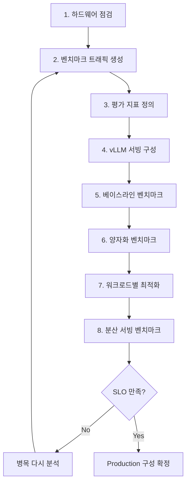
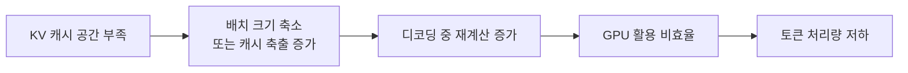
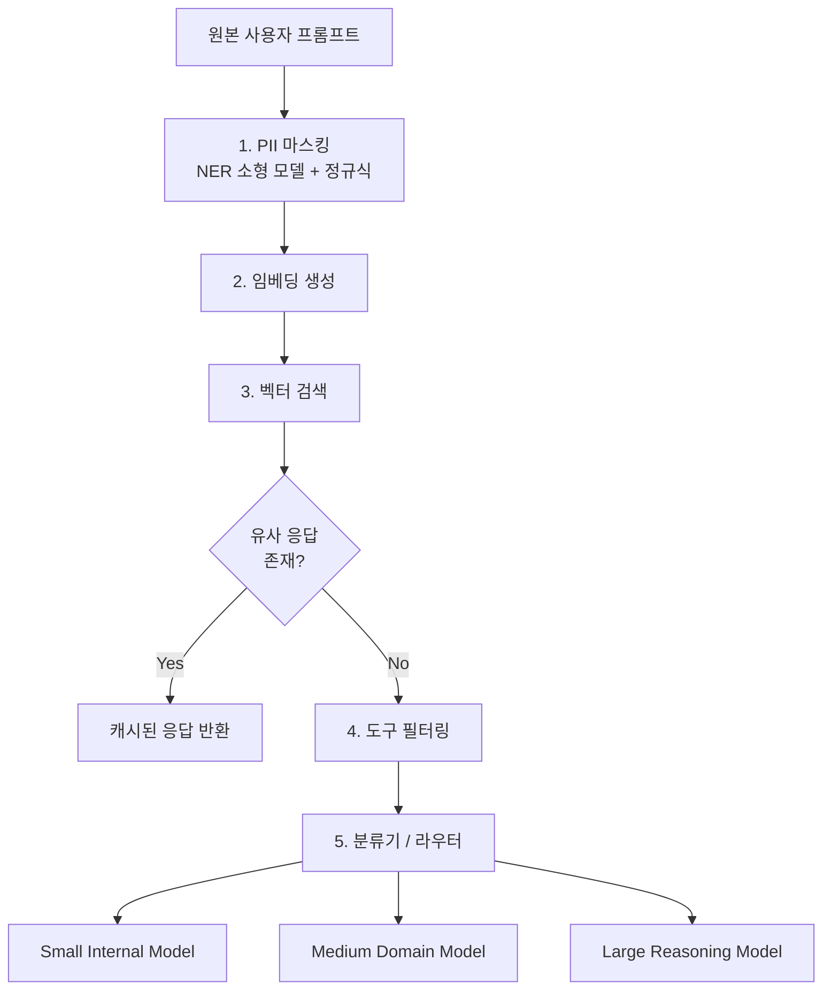
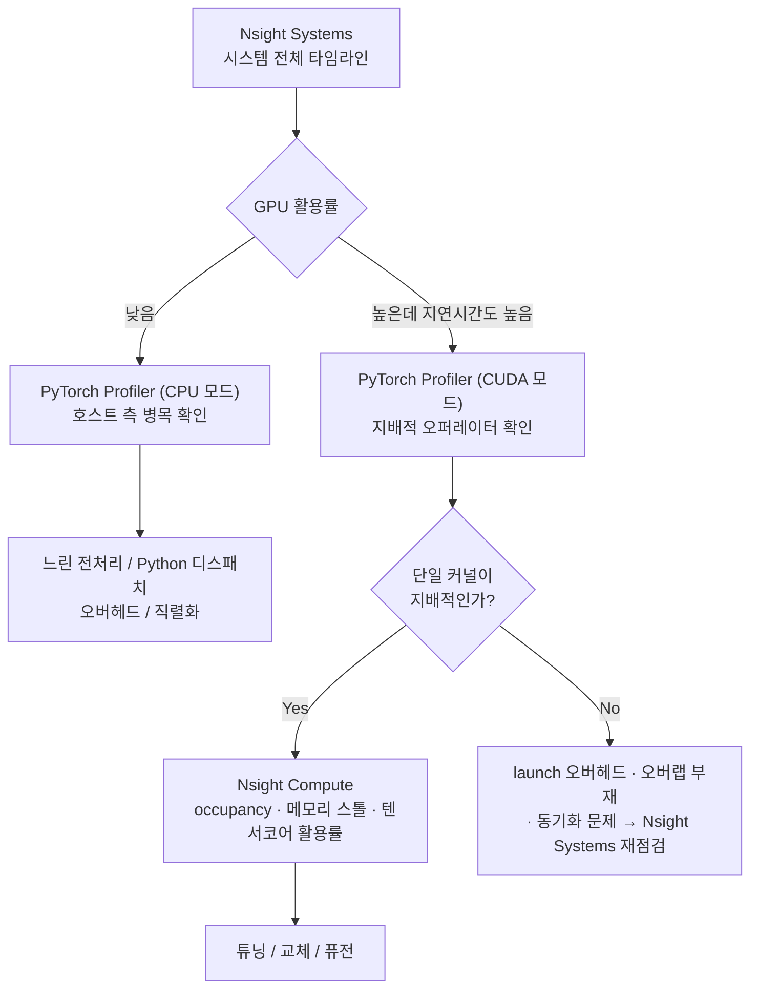

---
tags:
  - vLLM
  - LLM
  - Benchmark
  - Quantization
  - AWQ
  - Profiling
  - Nsight
  - Semantic Routing
  - Multimodal
  - Edge AI
---

# 실전 최적화와 LLM 서빙의 다음 단계

> Qwen3-14B와 vLLM으로 하드웨어 점검부터 벤치마크 설계·베이스라인 측정·양자화·분산 서빙까지 8단계 최적화를 실측으로 진행하고, 시맨틱 라우팅·프로파일링·멀티모달·엣지로 넓어지는 LLM 서빙의 다음 단계를 정리한다.

## 개요

앞선 주차가 개별 기법을 하나씩 이해하는 과정이었다면, 이번 주차는 그것들을 실제 워크로드에 총동원해 **측정하고 판단하는 과정**이다. 관통하는 메시지는 하나다.

> 최적화는 고정된 정답이 없는 "움직이는 목표"다.

환경이 바뀌면 최선의 전략도 바뀌고 자원은 한정돼 있어 모든 옵션을 무작정 시도할 수 없다. 그래서 목표는 정답 하나를 외우는 것이 아니라, 하드웨어·모델·KV 캐시·트래픽 패턴이 서빙 성능에 어떻게 작용하는지를 측정·해석해 자기 제약 안에서 좋은 구성으로 수렴하는 **직관**을 기르는 것이다.

스스로 답해볼 만한 질문 세 가지가 이 주차를 요약한다.

- 처리량이 올랐다는 건 GPU가 더 빨리 계산해서인가, 아니면 그냥 **덜 다시 계산해서**인가?

- GPU를 더 붙이면 무조건 더 빠른가?

- 여기서 찾은 "최적의 설정"은 다른 환경에서도 최적인가?

## 최적화 계획 수립

실습 대상은 `Qwen/Qwen3-14B` 온라인 서빙이고, 목표는 **단일 모델 인스턴스의 토큰 처리량 최대화**다. 대부분의 LLM 과금이 처리 토큰 수 기준이므로 처리량이 곧 비용이다. 같은 GPU 한 장에서 500 tokens/s와 1,500 tokens/s는 동일 비용으로 3배 차이를 뜻한다.

### 처리량과 지연시간의 관계

많은 최적화 기법은 처리량과 지연시간을 **동시에** 개선한다(불필요한 연산 제거, 배칭 효율 개선). 하지만 특정 트래픽 패턴에서는 둘이 본질적으로 상충한다.

- 처리량을 높이려면 요청을 배칭·큐잉해 하드웨어 활용도를 올려야 하는데, 이는 대기 시간을 만들어 요청당 지연시간을 늘린다.

- 반대로 최저 지연시간만 좇으면 요청이 오는 즉시 낮은 병렬성으로 처리하게 되어 자원 활용도가 떨어지고 전체 처리량이 낮아진다.

실무의 기본 자세는 **지연시간을 허용 범위 안에 묶어둔 채 처리량을 우선 개선**하는 것이다.

### 8단계 실행 계획



핵심은 이것이 일회성 절차가 아니라 **병목 발견 → 측정 → 개선 → 재측정**의 순환이라는 점이다.

## Step 1. 하드웨어 점검

코드를 짜기 전에 `nvidia-smi`로 사전 점검(pre-flight check)을 한다. 실습 환경은 AWS EC2 `g6e.2xlarge`(NVIDIA L40S, VRAM 약 46GB)다.

무엇을 보는지가 중요하다.

| 항목 | 의미 |
|------|------|
| CUDA / 드라이버 버전 | 선택한 서빙 프레임워크와 호환되는지 |
| Performance State | `P8`은 유휴, 서빙 중에는 `P0`/`P1`이 나타나야 정상 |
| 전력 사용량 + GPU 사용률 | 서빙 엔진이 GPU를 얼마나 포화시키는지 |
| 메모리 사용량 | 현재 할당된 GPU 메모리 |

```bash
nvidia-smi --query-gpu=name,compute_cap,memory.free,memory.used,memory.total --format=csv
```


유휴 상태의 L40S는 350W 한계 중 31W만 쓰고 있다. 여기서 정작 이후 모든 것을 제약하는 숫자는 전력 예산이 아니라 **46,068MiB**라는 메모리 총량이다. 뒤에서 보게 될 "가중치 27.5GB + KV 캐시 11GB" 배분이 바로 이 값을 나눠 쓴 결과다.

전력과 사용률을 **함께** 봐야 하는 이유가 이 단계의 핵심이다. 나중에 벤치마크 결과를 해석할 때 원인을 구분하는 기준이 되기 때문이다.

- 부하가 있는데 GPU 사용률이 낮다 → 배칭·스케줄링이 GPU를 못 채우고 있다

- 전력은 높은데 처리량이 낮다 → 메모리 병목이나 커널 비효율을 의심한다

## Step 2. 벤치마크 트래픽 생성

LLM 벤치마크에서 가장 흔한 실수는 **아무 프롬프트나 넣고 측정하는 것**이다. 그러면 실서비스와 전혀 다른 결과를 얻는다.

데이터셋 선택이 최적화 방향을 결정한다. 긴 입력이 지배적인 프리필 위주 워크로드와 긴 출력이 지배적인 디코드 위주 워크로드는 서로 다른 전략을 요구하기 때문이다. 이번 대상은 챗봇·대화형 시나리오이므로 상호보완적인 두 데이터셋을 쓴다.

| 데이터셋 | 성격 | 무엇을 평가하나 |
|----------|------|-----------------|
| ShareGPT | 실제 대화와 유사한 다양한 프롬프트 | 서빙 효율과 응답성(사용자 경험) |
| Prefix Repetition | 반복 패턴을 인위적으로 만든 합성 데이터 | 프리픽스 캐싱 등 캐시 재사용 동작 |

Prefix Repetition은 고유 접두사 수를 줄일수록 캐시 히트율이 올라가는 트래픽을 의도적으로 만들 수 있다는 점이 유용하다.


요청이 셋인데 **Prefill 박스는 하나뿐**이라는 점이 이 그림의 전부다. 동일한 모델에서 Prefix Repetition이 1,124 tok/s, ShareGPT가 474 tok/s를 기록하는 차이가 이 단일 노드에서 나온다. 숫자를 움직인 것은 모델이 아니라 트래픽 패턴이다.

벤치마크 전에 데이터의 길이 분포(min/max/mean/median/std)를 먼저 확인한다. ShareGPT 100개 샘플 기준 프롬프트 평균 232.6 토큰, 출력 평균 220.6 토큰으로 입출력 길이가 비교적 균형 잡혀 있음을 확인했다.

트래픽 생성은 vLLM의 부하 테스트 CLI를 쓴다. 프롬프트 수, 요청률, 최대 동시성, 버스트성을 제어해 재현 가능한 트래픽을 만들고 지표를 자동 수집한다.

이 단계는 "무엇을 측정할지"보다 먼저 **"어떤 트래픽으로 측정할지"를 확정**하는 단계이며, 이후 모든 단계의 기반이 된다.

## Step 3. 평가 지표 정의

전체 지표 체계는 다섯 범주로 나뉜다.

| 범주 | 주요 지표 |
|------|-----------|
| 처리량 | 총 토큰 처리량(TPS), 출력 토큰 처리량(TPS), 요청 처리량 |
| 지연시간 | TTFT, TPOT, ITL (평균 + P99) |
| 자원 활용도 | GPU 사용률, 메모리 사용량 |
| 워크로드 특성 | 입출력 토큰 비율, 동시성, 요청률 |
| 신뢰성/비용 | 오류율, 비용 효율 |

이 실습에서는 비교의 명확성을 위해 **처리량 2개 + 지연시간 2개**로 좁힌다.

- **총 토큰 처리량**: 입력 토큰과 출력 토큰을 합산한 초당 처리 속도. 시스템 전체 효율을 나타내는 고수준 지표다.

- **출력 토큰 처리량**: 초당 생성되는 출력 토큰 수. 디코딩 성능이자 LLM 비용의 주요 요인이다.

- **평균 TTFT**: 요청 시작 후 첫 토큰까지의 시간. 프리필 효율을 나타내며 토크나이징·큐잉·스케줄링 지연의 영향을 받는다.

- **평균 ITL**: 연속된 출력 토큰 사이의 평균 지연. 스트리밍 체감 품질을 좌우한다.

TTFT는 "첫 응답까지 얼마나 빠른가", ITL은 "스트리밍이 얼마나 매끄러운가"를 각각 대변하는 상호보완 지표다.

참고로 평균·중앙값·P99는 서로 다른 것을 본다. 평균은 이상치에 크게 흔들리고, 중앙값은 일반적인 사용자 경험을, **P99는 가장 나쁜 경험을 한 상위 1% 사용자**를 나타낸다.

## Step 4. 베이스라인 서버 구성

튜닝 없이 기본 설정으로 vLLM 서버를 띄운다.

```bash
vllm serve Qwen/Qwen3-14B
```

여기서 봐야 할 것은 서버 로그의 메모리 배분이다.

```
Model loading took 27.5185 GiB and 5.265852 seconds
Available KV cache memory: 11.00 GiB
GPU KV cache size: 72,064 tokens
Maximum concurrency for 40,960 tokens per request: 1.76x
```

46GB 중 38.5GB를 쓰는데, 그중 **모델 가중치가 27.5GB로 전체의 60% 이상**을 차지하고 KV 캐시에는 11GB밖에 남지 않았다. 이 로그가 베이스라인이 "메모리 병목 상태"임을 증명한다.


가중치 27.5GB가 자리를 차지하면 KV 캐시에는 11GB만 남고, 그것이 **72,064 토큰이라는 고정된 풀**로 환산된다. 즉 동시성은 직접 조절하는 값이 아니라 **파생되는 값**이다. 뒤에서 AWQ가 처리량을 사는 방식이 "연산을 빠르게"가 아니라 "가중치 박스를 줄여"인 이유가 여기 있다.

KV 캐시가 부족하면 다음 연쇄가 일어난다.



이 연쇄가 이 주차 내내 반복되는 **"메모리가 곧 처리량을 좌우한다"**는 논리의 구체적 형태다. 그리고 해결 방향도 여기서 도출된다. 모델을 양자화해 가중치를 줄이면 확보된 메모리를 KV 캐시로 돌릴 수 있고, 그만큼 배치 동시성이 올라간다.

## Step 5. 베이스라인 벤치마크

ShareGPT에서 프롬프트 2,000개를 초당 10요청으로 보낸다.

```bash
vllm bench serve --backend vllm --base-url "http://localhost:8000" \
  --dataset-name sharegpt --dataset-path ShareGPT_V3_unfiltered_cleaned_split.json \
  --num-prompts 2000 --request-rate 10 --burstiness 1.0 \
  --model Qwen/Qwen3-14B --max-concurrency 10 \
  --save-result --result-filename test_serve_results.txt
```

이 값이 이후 모든 실험의 기준선이다.

| 지표 | 베이스라인 |
|------|-----------|
| Total Throughput | 474.38 tok/s |
| Output Throughput | 227.64 tok/s |
| Mean TTFT | 104.15 ms |
| Mean ITL | 43.24 ms |
| P99 ITL | 72.15 ms |

### 같은 모델, 다른 트래픽

설정을 하나도 바꾸지 않고 **트래픽만** Prefix Repetition으로 교체하면 결과가 크게 달라진다.

| 지표 | ShareGPT | Prefix Repetition |
|------|----------|-------------------|
| Total TPS | 474 | **1,123** |
| Mean TTFT | 104.15 ms | 104.64 ms |
| Mean ITL | 43.24 ms | 43.95 ms |

처리량이 2.37배 올랐는데 **TTFT와 ITL은 사실상 그대로**다. 이 비대칭이 중요하다.

처리량 상승은 GPU가 더 빨리 계산해서가 아니다. 프리픽스 캐싱과 연속 배칭, 메모리 블록 공유 덕분에 **같은 계산을 반복하지 않아도 되기 때문**이다. 반면 개별 요청이 체감하는 첫 토큰 속도나 토큰 간 지연은 캐시 재사용 여부와 무관하므로 변하지 않는다.

```
캐시 없음:  Request A → Prefix 계산 + Suffix A
           Request B → Prefix 계산 + Suffix B
           Request C → Prefix 계산 + Suffix C

캐시 사용:  Prefix 계산 1회 → KV Cache 저장 → Suffix A / B / C 재사용
```

측정 중 GPU 사용률은 97%였다. GPU가 이미 최대한 활용되고 있다는 뜻이므로, 처리량 차이가 순전히 "얼마나 많은 계산을 재사용할 수 있는가"에서 비롯됐음을 뒷받침한다.

실무 시사점은 분명하다. 시스템 프롬프트 공유나 유사 질문 반복처럼 실제 트래픽에 반복 패턴이 많다면, **하드웨어 증설 없이 프리픽스 캐싱만 잘 활용해도 처리량을 크게 올릴 수 있다.**

## Step 6. 양자화 모델 벤치마크

Step 4에서 진단한 메모리 병목을 AWQ 4비트 양자화로 해결한다.

```bash
vllm serve Qwen/Qwen3-14B-AWQ
```

### 메모리 재분배

| 항목 | 원본 Qwen3-14B | Qwen3-14B-AWQ |
|------|----------------|---------------|
| 모델 가중치 | 27.5 GB | **9.36 GB** |
| KV 캐시 | 11 GB | **29.15 GB** |
| KV 캐시 토큰 | 72,064 | **191,056** |
| 최대 동시성 | 1.76x | **4.66x** |

가중치가 약 65% 줄면서 확보된 17GB가 그대로 KV 캐시로 넘어갔고, 저장 가능한 토큰이 2.65배로 늘었다.

### 성능 결과


| 지표 | Qwen3 | AWQ-Qwen3 | 변화 |
|------|-------|-----------|------|
| Total Throughput | 474.75 | 1,280.83 tok/s | 2.7배 |
| Output Throughput | 227.84 | 614.86 tok/s | 2.7배 |
| Mean TTFT | 103.61 | 59.29 ms | 42% 개선 |
| Mean ITL | 43.20 | 15.91 ms | 2.7배 개선 |

여기서 놓치기 쉬운 비대칭이 있다. **ITL은 2.7배 개선(43.20→15.91ms)인데 TTFT는 1.75배(103.61→59.29ms)에 그친다.** 양자화의 이득이 메모리 대역폭에 묶인 디코드 구간에서 훨씬 크고, 연산에 묶인 프리필에서는 상대적으로 작다는 뜻이다. "AWQ가 빠르다"는 한마디로 뭉개면 보이지 않는 차이다.


Prefix Repetition에서도 같은 방향의 개선이 나타나지만, 두 그림을 나란히 놓으면 **벤치마크 함정 하나**가 드러난다.

| 지표 (AWQ 기준) | ShareGPT | Prefix Repetition |
|-----------------|----------|-------------------|
| Total Throughput | 1,280.83 | **2,822.13** tok/s |
| Output Throughput | 614.86 | **562.57** tok/s |

총 처리량은 두 배 넘게 뛰는데 **출력 처리량은 오히려 조금 낮다.** 총 처리량 상승분이 대부분 캐시된 프리픽스 입력 토큰을 다시 계산에 넣은 결과이기 때문이다. 실제로 생성된 토큰은 줄었다. `total tok/s` 하나만 보고 성능을 판단하면 정확히 이 지점에서 속는다.

여기서 짚을 점은 **처리량과 지연시간이 동시에 개선됐다**는 것이다. 둘이 항상 트레이드오프는 아니라는 앞의 주장을 뒷받침하는 실증이며, GPU를 한 장도 더 붙이지 않고 얻은 결과다.

인과 사슬은 이렇게 정리된다.

```
양자화 → 모델 메모리 감소 → KV 캐시 증가 → 동시 요청 증가
      → 배치 효율 증가 → 처리량 증가
```

### 양자화도 공짜는 아니다

AWQ는 **가중치 양자화**라 데이터 이동과 메모리 절감에 초점이 맞춰져 있다. 연산량 자체를 줄이려면 활성화 양자화가 필요하다. 또한 정밀도를 낮추면 정확도 저하, 토큰 불안정성, 품질 변화가 나타날 수 있으므로 4bit·8bit·FP8 중 무엇을 쓸지는 **품질 허용 범위와 성능 목표의 균형**으로 결정해야 한다.

## Step 7. 워크로드별 추가 최적화

베이스라인에 양자화까지 적용했다면 이미 상당히 좋은 상태다. 그다음은 **트래픽 성격을 보고 고르는 것**이다.

| 워크로드 | 병목 | 적합한 기법 |
|----------|------|-------------|
| 프리필 위주 (긴 입력, 공유 컨텍스트) | 입력 처리 | LMCache — 반복 접두사의 KV 재사용 (멀티턴 채팅, RAG) |
| 디코드 위주 (긴 출력) | 토큰 생성 반복 | 추측 디코딩 — 드래프트 모델로 다중 토큰 예측 |

즉 **"무엇이 병목인가"를 먼저 진단한 뒤** 그에 맞는 기법을 고른다.


추측 디코딩과 KV 재사용이 **서로 배타적인 가지**에 놓여 있다는 점이 중요하다. 둘은 함께 켜서 쌓아 올리는 최적화 스택이 아니라, 워크로드의 모양에 따라 **택일하는** 선택이다.

주요 튜닝 노브는 두 갈래다.

```bash
# 메모리 / 캐시 계열
--gpu-memory-utilization 0.9   # KV 캐시에 쓸 GPU 메모리 비율
--max-model-len 4096           # 최대 컨텍스트 길이
--block-size 16                # 블록이 작을수록 캐시 활용도 향상

# 배칭 / 스케줄링 계열
--max-num-seqs 512             # 동시 처리 시퀀스 수
--max-num-batched-tokens 16384 # 배치당 토큰 수
--max-paddings 256             # 배칭을 위한 패딩 허용치
```

앞 단계에서 배운 개념을 실제 기동 파라미터로 연결한 예시는 다음과 같다.

```bash
vllm serve Qwen/Qwen3-14B-AWQ \
  --quantization awq \
  --gpu-memory-utilization 0.95 \
  --max-model-len 1024 \
  --block-size 16 \
  --enable-prefix-caching \
  --max-num-seqs 8 \
  --max-num-batched-tokens 8192 \
  --enable-chunked-prefill
```

### 과최적화 경고

여기에 중요한 단서가 붙는다. **하나의 특정 구성에 과도하게 최적화하지 말 것.** 특정 GPU 타입이나 트래픽 패턴에 완벽히 맞춘 설정은 다른 환경에서 성능이 나쁘거나 아예 실패할 수 있다. 서빙 파라미터를 과적합시키면 이식성과 유지보수성이 함께 무너진다.

최신 서빙 프레임워크는 하드웨어와 환경을 보고 합리적인 기본값을 스스로 추론한다. 그래서 실무자의 노력은 **"완벽한 파라미터 값 찾기"보다 "어떤 기법을 쓸지 판단하는 것"**에 집중해야 한다. Step 1의 "최적화는 움직이는 목표"라는 원칙이 여기서 "그러니 하나의 설정에 목숨 걸지 말라"는 구체적 조언으로 이어진다.

## Nsight 프로파일링: 처리량이 오른 진짜 이유

여기부터가 이 주차에서 가장 흥미로운 부분이다. RTX 4070 Ti SUPER 16GB 환경에서 Qwen3-4B(bf16)와 Qwen3-4B-AWQ(4bit)를 Nsight로 프로파일링해, **양자화가 처리량을 올린 진짜 메커니즘**을 커널 수준에서 검증했다.

먼저 소규모 환경에서도 책의 논리가 그대로 재현됐다.

| 지표 | ShareGPT (베이스) | ShareGPT (AWQ) |
|------|-------------------|----------------|
| 모델 가중치 | 7.56 GiB | 2.5 GiB |
| KV 캐시 / 토큰 | 4.74 GiB / 34,512 | 10.45 GiB / 76,064 |
| 최대 동시성 | 4.21x | 9.29x |
| 총 처리량 | 1,178 TPS | 2,107 TPS (+79%) |
| 평균 TTFT | 66.2 ms | 43.5 ms |

### 발견 1: GPU 연산 시간은 줄지 않았다

Nsight Systems로 측정한 결과가 반직관적이다.

- 총 GPU 커널 실행 시간은 두 모델이 **거의 동일**했다(~7.1초).
- 그런데 벤치마크 소요 시간은 AWQ가 **2.2배 빨랐다**(46.9초 → 21.5초).

"GPU가 실제로 계산하는 시간"은 그대로인데 "전체 소요 시간"만 줄었다. **처리량 개선의 원인이 순수 연산량 감소가 아니라는 뜻이다.**

### 발견 2: 커널 구성은 완전히 바뀌었다

| 커널 유형 | 베이스 (bf16) | AWQ (4bit) |
|-----------|---------------|------------|
| GEMM (bf16/f16, cutlass) | ~75% | 35.5% (2,024회, 매우 균일) |
| Marlin GEMM (4bit 역양자화+행렬곱) | 0% | ~35.6% (12,240회, 짧고 잦음) |
| FlashAttention | 15.3% | 15.7% (거의 동일) |

AWQ에서도 약 35%가 여전히 bf16 GEMM으로 남아 있다. **양자화가 전량 전환이 아니라는 뜻**이며, lm_head나 일부 attention projection은 원본 정밀도로 남는 경우가 많다. FlashAttention 비중이 양쪽에서 같은 것도 자연스럽다. 어텐션은 애초에 양자화 대상이 아니다.

### 발견 3: 진짜 병목은 호스트-GPU 동기화 대기였다

| 지표 | 베이스 (bf16) | AWQ (4bit) |
|------|---------------|------------|
| `cudaEventSynchronize` 비중 | 85.2% (25.6초) | 74.6% (11.5초) |
| 호출당 평균 대기 시간 | 13.92 ms | 5.67 ms (2.45배 단축) |
| 클라이언트 측정 TPOT | 15.3 ms | 7.0 ms (2.19배 단축) |

동기화 대기 시간 단축(2.45배)과 클라이언트가 체감한 TPOT 개선(2.19배)이 **방향과 크기가 거의 일치한다.** 디코딩 한 스텝이 끝나기를 기다리는 시간 자체가 짧아진 것이 체감 처리량 개선의 실제 메커니즘이다.


타임라인에서 봐야 할 것은 42μs라는 `cudaStreamSynchronize` 호출 시간 자체가 아니다. 같은 구간에서 **CUDA HW 커널 행이 거의 비어 있고 CPU 스레드는 `sem_wait`에 들어가 있다**는 점이다. 이 호출은 비용이 아니라 **GPU가 호스트 동기화를 기다리며 놀고 있다는 표지**이며, 집계된 평균 지표로는 절대 드러나지 않는 종류의 사실이다.

### 발견 4: 커널 하나하나의 효율은 그대로다

Nsight Compute로 커널 단위를 보면 결론이 한 번 더 확인된다.

| 항목 | 베이스 GEMM (cutlass bf16) | AWQ GEMM (Marlin int4) | 베이스 캐시 커널 | AWQ 캐시 커널 |
|------|---------------------------|------------------------|-----------------|--------------|
| Duration | 2.0~9.3 ms | 0.40~4.74 ms | 7.30 μs | 7.85 μs |
| Compute SM 처리량 | 47.1~48.5% | 45.0~47.8% | 25.9% | 26.8% |
| Achieved Occupancy | 16.66~16.67% | 16.65~16.68% | 65.86% | 65.77% |

완전히 다른 구현인데도 GEMM의 SM 점유율이 사실상 동일하다(~16.7%). **커널 하나하나의 효율은 양자화로 달라지지 않았다.** 낮은 점유율은 레지스터를 많이 쓰는 cutlass/marlin 계열 고성능 GEMM의 공통 설계 특성이지 양자화와 무관하다.


Nsight Compute는 낮은 점유율의 **원인**까지 지목한다. Marlin 커널은 스케줄러당 12개 워프 중 2개만 쓰는 16.7% 점유율인데, 그 제약 요인이 메모리 대역폭이 아니라 **255개에 달하는 레지스터 사용량**이라고 명시돼 있다(Compute 약 47% vs Memory 약 20%). 양자화된 커널은 대역폭에 굶주린 것이 아니라 **레지스터에 굶주린** 상태이며, "양자화는 빠르다"와는 전혀 다른 진단이다.

KV 캐시 쓰기 커널도 양쪽이 거의 동일하다(7.30μs vs 7.85μs). AWQ는 가중치만 4bit로 바꾸고 KV 캐시 자체는 bf16/fp16 그대로이므로 당연한 결과지만, **양자화가 어텐션·캐시 경로에는 영향을 주지 않는다는 것을 프로파일러로 직접 검증**한 셈이다.

### 종합

이 실험이 보여주는 것은 "AWQ 4bit 행렬곱이 bf16보다 계산량이 적다"가 **아니다.**

```
양자화 → 메모리 절감 → KV 캐시 여유 확보(34,512 → 76,064 토큰)
      → 디코딩 스케줄링이 촘촘해짐 → 스텝당 호스트-GPU 왕복 오버헤드 감소
      → 체감 처리량 향상
```

흥미롭게도 Marlin 커널은 개별 실행 시간이 짧은 대신 실행 횟수가 훨씬 많았는데(79,165회 vs 113,169회), 그럼에도 전체는 더 빨리 끝났다. **커널이 더 많이 실행돼도 각 디코딩 스텝의 턴어라운드가 짧으면 처리량은 오른다**는 것을 실측으로 확인한 것이다.

"양자화 = 연산 절감"이라는 단순한 이해보다 훨씬 정확한 인과 사슬을 GPU 프로파일러 수준에서 검증했다는 데 이 실험의 의미가 있다.

## Step 8. 분산 서빙

vLLM에서 여러 GPU에 모델을 올리는 것 자체는 간단하다.

```bash
vllm serve Qwen/Qwen3-14B-AWQ --tensor-parallel-size 2
```

이 절은 단일 서버 노드 내 멀티 GPU에 초점을 맞춘다. 초대규모가 아닌 대부분의 실무 시나리오가 여기 해당하기 때문이며, 멀티 노드가 필요하다면 앞 주차에서 다룬 프리필-디코드 분리를 권장한다.

주목할 관찰이 하나 있다. L40S는 일반적으로 **단일 GPU 추론에서는 A100보다 성능이 좋지만**, 분산 서빙 실험에서는 A100 8장을 탑재한 `p4d.24xlarge`가 L40S 4장의 `g6e.12xlarge`보다 **더 낮은 지연시간**을 보였다. 단일 GPU 성능 우위가 분산 환경에서 그대로 이어지지 않는다는 뜻이며, GPU 간 인터커넥트가 개입하기 때문이다.

!!! note "원본 자료의 범위"
    참고한 PDF는 분산 서빙 벤치마크 수치가 실리기 직전에서 끝난다. 그래서 이 절은 구성 방법과 관찰된 방향까지만 다루고, 구체적인 측정값은 싣지 않았다.

### 결론: 수평 확장 vs 수직 확장

전체 실습에서 얻은 결론 중 분산 서빙과 관련된 것은 다음과 같다.

- **무조건 멀티 GPU가 빠른 것이 아니다.**

- 대부분의 프로덕션 워크로드에서는 단일 GPU 레플리카를 여러 개 두는 **수평 확장이 처리량 면에서 유리**할 수 있다.

- 반대로 모델이 GPU 한 장에 안 들어가거나 요청당 지연시간을 줄여야 한다면 **TP 기반 수직 확장**이 필요하다.

## LLM 서빙의 다음 단계

여기부터는 "하나의 모델을 빠르게 실행하는 방법"에서 한 층 위로 올라간다. LLM 서빙은 요청의 의미를 이해하고 적절한 모델·도구·하드웨어·실행 위치를 선택하는 **지능형 추론 시스템**으로 발전하고 있다.

### 시맨틱 캐싱과 라우팅

기존 캐싱·라우팅이 프롬프트 문자열의 정확한 일치에 기반했다면, 시맨틱 방식은 임베딩과 벡터 검색으로 **의미가 같은 요청**을 인식한다.


두 개의 라우팅 결정이 서로 다른 층에 있다는 점이 먼저 정리돼야 한다. 시맨틱 라우팅은 **엔드포인트 수준**에서 "어떤 모델을 부를까"를 정하고, 앞 주차에서 다룬 데이터 병렬 로드밸런싱은 **복제본 수준**에서 "어느 사본으로 보낼까"를 정한다. 둘을 뭉개면 "우리는 이미 로드밸런서가 있다"는 말이 시맨틱 라우팅에 대한 답이 될 수 없는 이유를 놓친다.




원본 그림에서 특히 눈에 띄는 것은 **하나의 임베딩 벡터가 세 곳에 재사용**된다는 점이다. 응답 캐시 조회, 도구 선택, 모델 선택이 모두 같은 벡터를 쓰므로 임베딩 비용이 셋에 걸쳐 분산된다. 그리고 PII 마스킹이 임베딩 **이전**인 1단계에 있다는 배치가 중요하다. 그래야 벡터 DB에 남는 데이터가 안전해진다.

각 단계가 하는 일은 이렇다.

**1단계 PII 마스킹.** 원본 입력에는 이름·주소·연락처·카드번호·건강 정보가 섞여 있는 경우가 많다. 다운스트림의 로그·캐시·라우팅 결정이 개인정보를 노출하지 않도록 프라이버시 민감 개체에 파인튜닝된 소형 NER 모델로 위치와 카테고리를 찾아 `<NAME_1>`, `<EMAIL_1>` 같은 토큰으로 치환한다. 정규식을 함께 쓰는 경우도 많다.

**2단계 시맨틱 이해.** 프롬프트를 임베딩 벡터(예: 길이 768)로 바꾼다. "내 로그인 정보를 잊어버렸어"와 "비밀번호 재설정"은 비슷한 벡터를, "기사 초안을 작성해줘"는 매우 다른 벡터를 갖는다. 이 벡터로 이전 프롬프트-응답 쌍을 검색해 충분히 가까운 것이 있으면 **LLM 호출 없이** 캐시된 응답을 반환한다.

여기서 프리픽스 캐싱과의 차이가 분명해진다.

| 구분 | Prefix Cache | Semantic Cache |
|------|--------------|----------------|
| 기준 | 문자열·토큰 패턴 | 의미 |
| 재사용 조건 | 접두사가 정확히 일치 | 문장이 달라도 의미가 유사 |

**도구 필터링.** 에이전트가 쓸 수 있는 도구가 100개라면 모든 스키마를 LLM에 보내는 것은 프롬프트 토큰·컨텍스트·지연시간·비용을 모두 키우고 잘못된 도구를 고를 위험까지 높인다. 라우터가 벡터 검색으로 관련 도구 5개 정도만 추려 전달한다. MCP 기반으로 도구가 스키마·권한·메타데이터와 함께 등록되면서, 라우터는 **보안·정책·컴플라이언스의 중앙 집행점** 역할까지 맡는다.

**3단계 모델 선택.** 임베딩 벡터를 소형 분류기의 입력으로 써서 어떤 LLM을 호출할지, 추론 기능을 켤지 결정한다. 모든 요청을 가장 큰 모델로 보내는 것은 비효율이다.

```
간단한 질문      → Small Model
도메인 문제      → Internal Fine-tuned Model
복잡한 Reasoning → Large Reasoning Model
```

배경에는 실무적 인식 변화가 있다. 80억~320억 파라미터 규모의 **작업 특화 SLM**이 거대 범용 LLM과 대등하거나 더 나은 성능을 내면서, SLA/SLO 제어 측면에서 더 나은 신뢰성과 낮은 지연시간을 제공하는 경우가 많다는 것이다.

결국 라우팅의 단위가 "모델 복제본"에서 **"모델 엔드포인트"** 수준으로, 매칭 방식이 "정확 일치"에서 **"의미 기반"**으로 진화하고 있다는 것이 핵심이다.


구현을 보면 이 라우터가 요청 경로에 끼어드는 Python 서비스가 아니라, Rust/Candle 기반 분류기를 **Envoy의 ExtProc 필터**로 붙인 형태임을 알 수 있다. 더 흥미로운 것은 학습에 쓰인 세 데이터셋이 세 가지 역할에 1:1로 대응한다는 점이다. MMLU-Pro는 의도 분류, Jailbreak는 안전성, Presidio는 PII다. 즉 "라우터"라고 부르는 것의 실체는 **분류기 세 개**다.

관련 구현체로는 [vLLM Semantic Router](https://github.com/vllm-project/semantic-router)와 LiteLLM이 있다. LiteLLM은 100개 이상의 LLM 제공사 API를 OpenAI 형식 하나로 통일해 호출하게 해주는 게이트웨이로, 로드 밸런싱, Fallback/Retry, 비용 추적과 예산 관리, 캐싱(시맨틱 캐싱 포함), 가드레일·PII 마스킹, 관찰성 연동을 제공한다.

### 성능 프로파일링 전략

대규모 서빙에서는 **1퍼센트포인트 개선만으로도 수백만 달러의 인프라 비용을 절감**할 수 있다. 서빙 성능의 마지막 몇 퍼센트포인트는 선택적 사치가 아니라 운영상 필수가 됐다.

프로파일링은 세 계층으로 나뉜다.

| 계층 | 도구 | 무엇을 보나 |
|------|------|-------------|
| 서빙 | 벤치마크 지표 | 처리량, TTFT, ITL, GPU/메모리 활용률 |
| 프레임워크 | PyTorch Profiler | matmul·attention·layernorm 등 오퍼레이터별 실행 시간, CPU-GPU 데이터 이동, 연산-I/O 오버랩 |
| 런타임 | Nsight Systems → Nsight Compute | 오퍼레이터가 확장된 실제 CUDA 커널 내부 |

실무에서 진짜 어려운 것은 **언제 어떤 도구를 쓰고 한 계층에서 다음 계층으로 어떻게 넘어갈지** 아는 것이다. 증상에서 근본 원인까지 내려가는 흐름은 이렇다.




원본 흐름도에서 놓치기 쉬운 디테일이 하나 있다. **Nsight Systems가 두 번 등장한다.** 진입점이면서, 지배적인 단일 커널이 없을 때 되돌아오는 목적지이기도 하다. 프로파일링은 거친 것에서 세밀한 것으로 내려가는 일방통행이 아니라 **순환**이라는 뜻이다.

앞의 Nsight 실습이 정확히 이 흐름을 따랐다는 점을 짚어둘 만하다. 시스템 타임라인에서 "커널 시간은 같은데 전체는 빠르다"는 증상을 잡고, 커널 수준으로 내려가 점유율이 동일함을 확인한 뒤, 결국 동기화 대기라는 근본 원인에 도달했다.

### 멀티모달 서빙

LLM을 이미지·비디오·오디오를 처리하는 VLM으로 확장하는 흐름이다. 다만 구분할 것이 있다. 여기서 다루는 것은 **멀티모달 입력을 받되 여전히 자기회귀 디코더로 텍스트를 생성하는** 모델이다. Midjourney·Sora·Veo처럼 이미지·비디오를 **생성**하는 모델은 확산(diffusion) 기반의 다른 아키텍처라 범위 밖이다.

이미지는 프롬프트 안에서 플레이스홀더 토큰으로 표현된다.

```
<|im_start|>user
<|vision_start|><|image_pad|><|vision_end|>Describe this image.<|im_end|>
<|im_start|>assistant
```


텍스트는 토크나이저를 거치지만 **이미지는 그것을 완전히 건너뛴다.** 인코더 출력이 임베딩 수준에서 합쳐지므로, 이미지는 통상적인 의미의 토큰 수를 갖지 않는다. 토큰 기준으로 돌아가는 배칭과 과금 가정이 여기서 깨진다는 점이 시스템 설계에 직접 영향을 준다.

처리 시점에 텍스트 토큰은 평소처럼 텍스트 임베딩으로 매핑되고, **이미지 플레이스홀더는 Vision Encoder가 만든 임베딩으로 대체**된다. Vision Encoder는 이미지를 작은 패치로 나누고, 각 패치를 LLM의 히든 차원으로 투영한 뒤, 패치끼리 어텐션시켜 공간적·의미적 관계를 인코딩한다. LLM 입장에서는 결국 텍스트 임베딩과 비전 임베딩이 섞인 **하나의 긴 임베딩 시퀀스**로 들어온다.

#### 병목이 GPU에서 CPU로 이동한다

이 주차에서 가장 실무적인 통찰이 여기 있다. 텍스트 토큰화는 가볍지만 이미지 전처리는 다르다.

```
Image decode → Resize → Crop → Color conversion → Tensor transform → Normalize
```

이 작업들은 상당 부분 CPU 집약적이고, **LLM이 시작되기 전에 순차적으로 완료돼야 한다.** 연산이 앞단에 몰리면서 초기 CPU 병목이 생기고, 요청률이 높아져 CPU가 포화되면 강력한 GPU가 유휴 상태로 남는다. 전체 처리량을 제한하는 것이 더 이상 LLM이 아니라 **비전 전처리 단계**가 되는 것이다.


GPU의 `Waiting…` 막대가 CPU의 세 전처리 단계 전체에 걸쳐 있다. VLM 트래픽에서는 추론이 시작되기도 전에 가속기가 **PIL 수준의 CPU 작업을 기다리며 멈춰 있다.** 이것이 vLLM의 프로세스 분리가 제거하려는 구체적 병목이다.

vLLM V0 → V1의 진화가 이 문제의 해법을 보여준다.

| 버전 | 구조 | 결과 |
|------|------|------|
| V0 | API 서버 + 전처리 + GPU 스케줄링이 서로 영향 | CPU 블로킹 → GPU 유휴 시간 발생 |
| V1 | Process 0(API·전처리·후처리) / Process 1(GPU 커널 스케줄링·실행) 완전 분리 | 두 프로세스가 비동기 동시 실행 → CPU 작업이 GPU를 막지 않음 |

핵심은 **CPU 전처리가 느려도 GPU 커널 실행 루프를 막지 않도록 분리하는 것**이며, 그 결과 텍스트와 멀티모달 워크로드 모두에서 처리량이 크게 올랐다.

### 엣지 AI

점점 더 많은 AI 워크로드가 엣지 디바이스에서 서빙되고 있다. 이 변화를 이끄는 힘(Drivers)과 가능케 하는 수단(Enablers)을 구분해 보면 정리가 쉽다.

**3대 동인(Why)**

| 동인 | 내용 |
|------|------|
| 지연시간 | 로보틱스·자율주행·AR/VR은 밀리초 단위 반응이 필요해 클라우드까지의 20~50ms 왕복조차 용납되지 않는다 |
| 데이터 로컬리티 | 의료·금융 등 민감 데이터를 로컬에서 처리해 GDPR·HIPAA 준수와 유출 위험 감소 |
| 비용 | IoT 센서·고해상도 카메라의 대용량 데이터를 로컬에서 걸러 요약만 클라우드로 보내 대역폭·저장 비용 절감 |

**5대 인에이블러(How)**

- **특화된 저전력 하드웨어**: NPU 등 AI 가속기. 핵심 지표가 TOPS/W(와트당 연산량)라는 점이 중요하다. 클라우드가 "성능"을 목표로 한다면 엣지는 **"효율성"**을 목표로 한다.

- **모델 압축/최적화**: 양자화·프루닝·증류에 KV 캐싱·추측 디코딩까지. 메모리 제약 때문에 엣지에서는 선택이 아니라 필수다.

- **이기종 컴퓨트**: CPU(전처리) → NPU(연산 집약 레이어) → GPU(후처리)로 작업을 분담한다. 파이프라인 병렬성과 유사한 개념이며, 고급 런타임은 레이어 단위 서브그래프 파티셔닝까지 지원한다.

- **열 인지 스케줄링**: 팬 없는 디바이스는 발열이 곧 성능 저하다. 온도를 모니터링하며 모델 축소·프레임레이트 감소·코어 이전으로 동적 대응한다.

- **엣지-클라우드 하이브리드**: 웨이크워드 감지나 경량 전처리는 엣지에서, 무거운 추론은 클라우드에서 처리하고 대역폭·배터리·발열·지연시간 조건에 따라 오프로딩을 동적으로 결정한다.

엣지 AI는 클라우드 모델을 단순히 축소한 것이 아니라, 하드웨어·압축·이기종 컴퓨트·열관리·클라우드 협업이 종합적으로 결합돼야 실현되는 **시스템 엔지니어링의 결과물**이다.

## 마무리

- 최적화는 정답을 외우는 일이 아니라 **병목을 찾고 측정하고 개선하고 재측정하는 순환**이다. 8단계 계획은 그 순환을 구조화한 것이다.

- 벤치마크는 실제 트래픽을 닮아야 한다. 같은 모델·같은 설정에서 트래픽만 ShareGPT에서 Prefix Repetition으로 바꿔도 처리량이 2.37배 차이 났다. **데이터셋 선택이 최적화 방향을 결정한다.**

- 양자화의 효과는 "연산이 줄어서"가 아니라 **"가중치가 줄어 KV 캐시가 늘고, 그래서 배칭·스케줄링이 촘촘해져서"**다. Nsight 프로파일링에서 GPU 커널 총 실행 시간은 그대로인데 동기화 대기가 2.45배 줄어든 것이 그 증거다.

- 처리량과 지연시간이 항상 상충하는 것은 아니다. AWQ 양자화는 GPU를 늘리지 않고도 처리량 2.7배와 TTFT 42% 개선을 동시에 얻었다.

- 하나의 구성에 과적합하지 말 것. 특정 GPU·트래픽에 맞춘 설정은 이식성을 잃는다. 노력은 **파라미터 값 찾기보다 기법 선택**에 쓰는 것이 낫다.

- 멀티 GPU가 항상 답은 아니다. 대부분의 프로덕션에서는 단일 GPU 레플리카의 수평 확장이 처리량에 유리하고, 모델이 안 들어가거나 요청당 지연시간이 급할 때 TP 수직 확장이 필요하다.

- 서빙 시스템은 모델 실행기를 넘어 **요청의 의미를 이해하고 모델·도구·실행 위치를 고르는 지능형 추론 시스템**으로 넓어지고 있다. 시맨틱 라우팅, 계층적 프로파일링, 멀티모달, 엣지가 그 방향을 보여준다.

- 병목은 늘 GPU가 아니다. 멀티모달에서는 CPU 전처리가, 양자화 이후에는 호스트-GPU 동기화가 병목이었다. **병목 이동을 진단하는 눈**이 최적화의 핵심 역량이다.

## 참고

- [vLLM Docs - Benchmark Suites](https://docs.vllm.ai/en/latest/contributing/benchmarks.html)
- [Qwen3-14B](https://huggingface.co/Qwen/Qwen3-14B) / [Qwen3-14B-AWQ](https://huggingface.co/Qwen/Qwen3-14B-AWQ)
- [ShareGPT Dataset](https://huggingface.co/datasets/anon8231489123/ShareGPT_Vicuna_unfiltered)
- [vLLM Semantic Router](https://github.com/vllm-project/semantic-router)
- [LiteLLM - AI Gateway](https://docs.litellm.ai/)
- [LiteLLM - Routing & Load Balancing](https://docs.litellm.ai/docs/routing-load-balancing)
- [PyTorch Profiler](https://pytorch.org/tutorials/recipes/recipes/profiler_recipe.html)
- [NVIDIA Nsight Systems](https://developer.nvidia.com/nsight-systems)
- [NVIDIA Nsight Compute](https://developer.nvidia.com/nsight-compute)
- [vLLM Docs - Multimodal Inputs](https://docs.vllm.ai/en/latest/features/multimodal_inputs.html)
- [vLLM V1 Alpha 발표](https://blog.vllm.ai/2025/01/27/v1-alpha-release.html)
